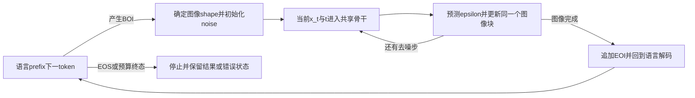

# 17｜统一多模态生成与码流实践

> 先修：[视觉接入16](16-视觉编码与语言接入实践.md)、[离散瓶颈训练](12-神经音频编码与说话人表征.md#6-训练离散瓶颈直通估计码本与承诺损失)、[扩散与流匹配](../深度学习专题/21-扩散流匹配与条件生成.md)。本章学习同一系统怎样接收和产生不同模态：固定表示与目标，检查共享参数和监督位置，再走完采样与码流状态。图像/视频的具体生成结构和评价由[09](09-视觉生成与视频时序.md)维护，音频任务由[14](14-语音合成生成与音频语言模型.md)维护。
>
> 本章五个完整程序仅用合成数组、小随机网络和内存队列。它们验证真实前向/梯度、标签、mask和控制流程，未训练真实多模态模型、解码真实图片/音频或调用模型API。来源及作者核验范围见文末。

## 1. 统一的是什么：输入、骨干、目标和输出分别检查

首先区分原始图像/波形、连续特征或latent、离散code ID、进入骨干的embedding、预测head和最终decoder。离散ID要经查表才能进入网络；连续embedding也可能来自离散ID，所以“张量为float”不能决定生成目标是连续回归。不同encoder输出同样宽度不代表语义已对齐。

例如图像encoder输出 `[B,N_v,D_v]`，bridge接成 `[B,N_v',D]`；文字ID查表成 `[B,N_t,D]`。共同D使它们能接入共享attention，但模型是否能回答图片问题，取决于训练和证据。只预测文字的理解型VLM不自动产生图像；输出VQ码也不自动获得波形、图片或控制效果，仍需要配套decoder或动作执行层。

| 路线与方法例证 | 骨干看见的内容 | 主要预测目标 | 生成时改变的状态 |
|---|---|---|---|
| 理解型VLM、InternVL3 | 连续视觉特征与文字 | 有效文字位置的next-token CE | 文字prefix；视觉是可传梯度的条件 |
| Chameleon、Emu3 | 文字/视觉离散码的embedding | 共享分类词表上的CE | 逐步把新ID喂回prefix，再用codec还原 |
| 原Transfusion | 文字embedding与noisy VAE latent patches | 文字CE + 图像DDPM noise MSE | 当前图像块在不同去噪时刻被覆盖 |
| 原Show-o | 文字、可见图像码及MASK | 文字NTP + masked图像码CE | 本轮预测后重mask低置信位置，再读新上下文 |
| Janus-Pro | 理解前端与生成码前端分开，部分骨干共享 | 理解文字CE、生成图像码CE | 按任务选择输入/输出路径 |
| MIO | text/image/speech/video各自码序列 | 有效位置的NTP | 模态边界、码本排布、decoder缓冲 |
| Thinker/Talker类Omni | 感知表征、文字embedding/hidden history | 文字与语音codec目标 | 多个阶段的生成历史与可取消的音频packet |

“统一”可以是共享部分骨干，而前端、head和loss仍有分工。MMDiT的文本和图像联合attention是条件图像生成结构，文本作为conditioning不等于额外训练了文字NTP；同为两模态也不能把它叫Transfusion的同一目标。

## 2. 离散视觉码与共享词表：先学会码，再学会预测码

VQ链通常先学习encoder→nearest code→decoder。最近码索引不可微，straight-through estimator、codebook与commitment目标解决训练路径；具体梯度和完整量化链复用[音频12第6节](12-神经音频编码与说话人表征.md#6-训练离散瓶颈直通估计码本与承诺损失)，该机制也可用于图像。下游AR骨干常读取冻结codec生成的ID；它的CE训练不能倒推为已经训好encoder、码本和像素decoder。

若码本K项，N个固定长ID至少需 `N ceil(log2 K)` bits基础索引载荷。还需shape、顺序、special token、容器及decoder；通常是有损表示。重建缺失小字，后续语言模型很难从这些码恢复本来就没有的信息。更大K增加容量，也增加分类难度和输出head规模，并不保证每个码被使用或质量单调改善。

Chameleon作者视觉tokenizer将512²图像压为1024个ID，K8192；共享总词表65536包含图像码与文字/特殊项。它的骨干预测统一序列，不是一个bigram表就复现了视觉生成。原教材固定16个码向量实际有8个不同值、四个块均值变四ID，缺少学习与重建；本章不保留它的“生成图片”结论。[Chameleon作者§2.1](https://arxiv.org/html/2405.09818v1)。

Emu3使用空间8×8、时间4的codec压缩，通用预算为 `T' H' W'`，512²静态图为4096码；视频的首帧/padding、EOL/EOF和尺寸/FPS等metadata另计。教材的4×4×4不是作者对应配置。“理解/生成/未来预测”可共用建模框架，仍可能有不同后训练checkpoint；不能只换prompt就假定任何权重具备全部功能。[Emu3作者方法](https://arxiv.org/html/2409.18869v1)。

### 2.1 下一码的预测必须依赖当前prefix

自回归分解为：

$$
p(z_1,\ldots,z_N\mid c)=\prod_{i=1}^N p_\theta(z_i\mid c,z_{<i}).
$$

训练时右移输入与labels，并阻断未来位置；生成时每轮真正前向读取刚生成的prefix。预先造一组独立随机logits再依次取样，只演示取样函数，没有实现这个条件依赖。合法图像子词表、shape、结束标记与context上限也要检查，不把ID数值大小当像素亮度。

CFG在同一生成状态上比较条件/无条件两次预测。logit形式 `l=l_u+w(l_c-l_u)`，w=0为无条件、w=1为条件；之后才按temperature和截断取样。两个分支的**已生成码prefix相同**，只改变条件。真实可用的无条件分支需训练时条件dropout或相应协议；用一个未按null条件训练的替代ID替换条件，数学表达正确也不保证质量。

Chameleon作者还处理混合模态训练中的norm/logit drift。QK-Norm对attention的query/key做归一；norm placement、输出logit约束和优化方法也影响稳定性。下面纯Python函数只展示点积的数量级改变；后面的tiny标准Transformer并未实现原模型全部QK-Norm/reordered norm或34B训练。Softmax对整体平移不变，而数值尺度、熵和参数增长仍会影响优化，不能把“loss暂时有限”当长期稳定保证。

```python
import math, re
from collections import Counter
import torch
from torch import nn
from torch.nn import functional as F

torch.set_num_threads(1); torch.manual_seed(31)
BOS,EOS,OPEN,CLOSE=0,1,2,3
TEXT=range(4,8); IMAGE=range(8,12); V,D=12,16
BOOK=torch.tensor([-1.,-.3,.3,1.])  # 固定标量码本，不训练codec。

def qknorm(values):  # 纯Python LayerNorm，无可训练affine。
    if not values: raise ValueError('非空向量')
    mean=sum(values)/len(values)
    var=sum((v-mean)**2 for v in values)/len(values)
    return [(v-mean)/math.sqrt(var+1e-5) for v in values]
q=[1000.*(i-32) for i in range(64)]; k=[2000.*(i-30) for i in range(64)]
raw=sum(a*b for a,b in zip(q,k)); normalized=sum(a*b for a,b in zip(qknorm(q),qknorm(k)))
assert abs(sum(qknorm(q)))<1e-8 and abs(normalized)<65
print('QK点积 raw/normalized:',raw,round(normalized,6))

def route(prompt):
    if re.search(r"\b(?:not|never|if|unless)\b|don't",prompt.lower()):
        raise ValueError('含本例支持的否定/条件词，需另行解析；本例不是通用语义路由')
    verbs=re.findall(r'\b(describe|caption|draw|sketch|generate)\b',prompt.lower())
    plan=[]
    for v in verbs:
        task='understand' if v in ('describe','caption') else 'generate'
        if task not in plan: plan.append(task)
    return tuple(plan) if plan else ('clarify',)
assert route('Describe and then sketch a cat')==('understand','generate')
try: route("Do not draw a cat")
except ValueError: pass
else: raise AssertionError('不能执行被否定的生成要求')
try:route('If it rains, draw a cat')
except ValueError:pass
else:raise AssertionError('条件触发未确认不得直接生成')

class SharedAR(nn.Module):
    def __init__(self):
        super().__init__(); self.emb=nn.Embedding(V,D); self.pos=nn.Embedding(32,D)
        layer=nn.TransformerEncoderLayer(D,2,32,dropout=0.,batch_first=True)
        self.body=nn.TransformerEncoder(layer,1,enable_nested_tensor=False)
        self.head=nn.Linear(D,V)
    def forward(self,ids):
        if ids.ndim!=2 or ids.dtype!=torch.long or not 0<ids.shape[1]<=32 or (ids<0).any() or (ids>=V).any():
            raise ValueError('B×T合法ID与位置范围')
        n=ids.shape[1]; forbidden=torch.ones(n,n,dtype=torch.bool).triu(1)
        h=self.emb(ids)+self.pos(torch.arange(n))[None]
        return self.head(self.body(h,mask=forbidden))  # True=禁止。

# 每10样本6 text-first/4 image-first；只人为短序列，不是真实图文。
seqs=[]
for i in range(40):
    c=i%2; img=[OPEN,8+c,9+c,8+c,9+c,CLOSE]; txt=[4+c,6+c]
    seqs.append([BOS]+(txt+img if i%10<6 else img+txt)+[EOS])
full=torch.tensor(seqs); inp=full[:,:-1]; labels=full[:,1:]
assert torch.equal(inp[:,1:],labels[:,:-1])
model=SharedAR().eval()
with torch.no_grad():
    original=model(inp[:1]); changed=inp[:1].clone(); changed[:,-1]=4
    assert torch.allclose(original[:,:3],model(changed)[:,:3],atol=1e-6)
    a=model(torch.tensor([[BOS,4]]))[:,-1]; b=model(torch.tensor([[BOS,5]]))[:,-1]
    assert (a-b).abs().max()>1e-5  # 同长度不同prefix实际改变预测。
old=model.body.layers[0].linear1.weight.detach().clone()
opt=torch.optim.Adam(model.parameters(),lr=.01)
for _ in range(80):
    logits=model(inp); loss=F.cross_entropy(logits.reshape(-1,V),labels.reshape(-1))
    opt.zero_grad(set_to_none=True); loss.backward(); opt.step()
assert not torch.equal(old,model.body.layers[0].linear1.weight)
assert torch.isfinite(loss) and all(p.grad is not None and torch.isfinite(p.grad).all() for p in model.parameters())

def draw(prefix,allowed):
    allowed=list(allowed)
    if not allowed or len(set(allowed))!=len(allowed) or any(type(i) is not int or not 0<=i<V for i in allowed):raise ValueError("非空合法候选词表")
    with torch.no_grad(): scores=model(torch.tensor([prefix]))[0,-1]
    probs=scores[list(allowed)].softmax(0)
    return list(allowed)[torch.multinomial(probs,1).item()]
# 控制器固定图像shape与边界；4个码和后续text由模型条件分布逐次抽样。
prefix=[BOS,4,OPEN]; calls=0; codes=[]
for _ in range(4):
    tok=draw(prefix,IMAGE); prefix.append(tok); codes.append(tok-8); calls+=1
prefix.append(CLOSE); prefix.append(draw(prefix,TEXT)); calls+=1; prefix.append(EOS)
latent=BOOK[torch.tensor(codes)].reshape(2,2)
assert len(codes)==4 and latent.shape==(2,2) and calls==5
try: BOOK[torch.tensor([4])]
except IndexError: pass
else: raise AssertionError('码本ID不能越界')
order=Counter('image' if draw([BOS],[OPEN,4,5,6,7])==OPEN else 'text' for _ in range(500))
print('真实CE/参数更新/因果扰动通过；NLL=',round(loss.item(),5))
print('混合序列',prefix,'合成latent',latent.tolist(),'model_calls',calls)
print('首次模态500次抽样',dict(order),'训练分布text=.6,image=.4；非真实模型质量')

with torch.no_grad():
    conditional=[BOS,4,OPEN,8,9]
    unconditioned=[BOS,7,OPEN,8,9]  # 教学null条件，未训练真实无条件分支。
    assert conditional[2:]==unconditioned[2:]
    c=model(torch.tensor([conditional]))[0,-1]
    u=model(torch.tensor([unconditioned]))[0,-1]
    guided=lambda w:u+w*(c-u)
    assert torch.allclose(guided(0),u) and torch.allclose(guided(1),c)
    assert not torch.allclose(guided(3),guided(5))
    print('CFG同当前prefix、w0/w1合同通过；训练真实CFG还需conditional dropout')
```

程序真实优化了共享骨干并逐码前向，训练数据是重复的40条短人造序列。500次合法首模态抽样得到text302/image198，是这组训练/抽样的局部结果；它不是真实模型的图文偏好或零样本任务成绩。shape、BOI/EOI与末尾EOS由控制器规定，2×2数组只是固定码本的合成latent，未有像素decoder。`route`仅识别列出的英文动词及部分否定/条件词，其他语义要澄清或交给完整规划层，不能用substring自动执行实际任务。

## 3. 连续图像和文字共享骨干：mask、loss与两种解码状态

连续路线避免把所有图像内容量化成分类ID，但仍有VAE/投影和重建误差。原Transfusion的训练输入是noisy VAE latent，不是完全无encoder的raw pixels；noise/timestep必须真正进入模型。它预测DDPM epsilon，flow matching在原论文被列为后续方向，不能把源代码里`noise-clean`直接当其作者目标。[Transfusion作者§2–3](https://arxiv.org/html/2408.11039v1)。

### 3.1 因果顺序与同图双向能够同时成立

序列可为 `text—BOI—imageA patches—EOI—text—BOI—imageB patches—EOI—text`。key j对query i合法的基本条件是：

$$
A_{ij}=\big[(j\le i)\lor\operatorname{sameImage}(i,j)\big]
\land\operatorname{sameSample}(i,j)\land\operatorname{validKey}(j).
$$

`sameImage`只在同一图的patch之间成立；BOI/EOI属于正常离散序列元素。后图可读前图，前图不可读未来图；同图双向不允许跨packed sample泄漏。处理padding时还要区分无效query输出及全mask行。本例全部位置有效，只演示sample隔离，不冒称实现任意padding生产接口。

mask正确还不足以排除目标泄漏。image输入是x_t，监督是noise ε；clean x0和真noise只能用于构造训练样本/目标，不能作为额外forward字段。Show-o的masked码输入是MASK，而gold码只在label里；VAR的本尺度输入只由过去尺度构造，不能混成同一套shift规则。

### 3.2 两种loss确实作用于同一组参数

按注明的归一化定义：

$$
x_t=\sqrt{\bar\alpha_t}x_0+\sqrt{1-\bar\alpha_t}\,\epsilon,\quad
L=L_{text}+\lambda L_{image},\quad
\nabla_\theta L=\nabla_\theta L_{text}+\lambda\nabla_\theta L_{image}.
$$

文字CE监督下个有效离散目标；输入BOI后下一个是连续patch，因此该位置没有文字CE，但**从前文字预测BOI**仍可监督。最后patch之后预测EOI也有离散目标。图像MSE要说清按元素、patch、image还是batch平均；不同长度/数量改变尺度，样本占比不自动等于梯度占比。

原论文采用cosine noise schedule，指定实验λ=5、评估250个diffusion steps；它们是作者协议，不是所有模型的最优值。本例等长两图、二维latent、20步cosine，只验证计算路径及一个实际参数更新；没有复现论文训练规模。[作者训练与推理§4.1](https://arxiv.org/html/2408.11039v1)。

### 3.3 图像的去噪时刻不能追加成语言的历史



每次更新覆盖同一image block，旧x_t不成为新可见图像。固定text prefix可以设计独立KV缓存，但当前image K/V随状态变化，不能不重算就沿用。下面走完这个状态切换，同时检查separator、两图、packed sample、future扰动、mask关闭对照、真实xt/t依赖及共享梯度加和。

```python
import torch
from torch import nn
from torch.nn import functional as F

torch.set_num_threads(1); torch.manual_seed(32)
D,V,T=16,8,20
# 与DDPM epsilon目标配套的cosine累计信号；beta截到.999避免最后一步除0。
import math
s=torch.arange(T+1,dtype=torch.float64)/T
f=torch.cos((s+.008)/1.008*math.pi/2).square(); target=f/f[0]
BETAS=(1-target[1:]/target[:-1]).clamp(.000001,.999).float()
ALPHA=1-BETAS; AB=torch.cat([torch.ones(1),ALPHA.cumprod(0)])

def allowed_mask(blocks,samples):
    n=len(blocks); earlier=torch.arange(n)[None,:]<=torch.arange(n)[:,None]
    same=(blocks[:,None]==blocks[None,:]) & (blocks[:,None]>=0)
    return (earlier|same)&(samples[:,None]==samples[None,:])

class Hybrid(nn.Module):
    def __init__(self):
        super().__init__(); self.text=nn.Embedding(V,D); self.pos=nn.Embedding(32,D)
        self.image=nn.Linear(2,D); self.time=nn.Linear(1,D)
        self.body=nn.TransformerEncoder(nn.TransformerEncoderLayer(D,2,32,dropout=0.,batch_first=True),1,
                                        enable_nested_tensor=False)
        self.text_head=nn.Linear(D,V); self.noise_head=nn.Linear(D,2)
    def forward(self,ids,blocks,xt,t,samples=None,ignore_mask=False):
        if ids.ndim!=2 or ids.shape[0]<1:raise ValueError("非空B×T IDs")
        n=ids.shape[1]; patch=blocks>=0; samples=torch.zeros(n,dtype=torch.long) if samples is None else samples
        if ids.dtype!=torch.long or not 0<n<=32 or (ids<0).any() or (ids>=V).any(): raise ValueError('合法ID')
        if xt.shape!=(len(ids),int(patch.sum()),2) or t.shape!=xt.shape[:2]: raise ValueError('xt/time形状')
        if blocks.shape!=(n,) or blocks.dtype!=torch.long or samples.shape!=(n,) or samples.dtype!=torch.long:
            raise ValueError('block/sample ID shape与dtype')
        if (blocks<-1).any() or (samples<0).any():raise ValueError('block仅-1或非负、sample非负')
        if not torch.isfinite(xt).all() or not torch.isfinite(t).all() or (t<0).any() or (t>1).any():raise ValueError('有限xt和[0,1]time')
        mask=allowed_mask(blocks,samples)
        if ignore_mask:mask=torch.ones_like(mask)
        if not mask.any(-1).all(): raise ValueError('每个query需要合法key')
        h=self.text(ids); h[:,patch]=self.image(xt)+self.time(t[:,:,None])
        h=h+self.pos(torch.arange(n))[None]; h=self.body(h,mask=~mask)
        return self.text_head(h),self.noise_head(h)[:,patch]

ids=torch.tensor([[1,2,3,0,0,4,2,3,0,0,4,2]]).repeat(3,1)
blocks=torch.tensor([-1,-1,-1,0,0,-1,-1,-1,1,1,-1,-1]); patch=blocks>=0
mask=allowed_mask(blocks,torch.zeros(12,dtype=torch.long))
assert mask[3,4] and mask[8,3] and mask[2,2] and mask[5,3] and not mask[3,8]
packed=allowed_mask(blocks.repeat(2),torch.tensor([0]*12+[1]*12))
assert not packed[:12,12:].any() and not packed[12:,:12].any()
z0=torch.randn(3,4,2); noise=torch.randn_like(z0)
steps=torch.randint(1,T+1,(3,2)); per_patch=steps.repeat_interleave(2,dim=1)
a=AB[per_patch].sqrt()[:,:,None]; sigma=(1-AB[per_patch]).sqrt()[:,:,None]
xt=a*z0+sigma*noise; time=per_patch/T
model=Hybrid().eval(); text_logits,pred=model(ids,blocks,xt,time)
# clean/noise只进入loss，不进入forward；label为下一位置的离散目标。
discrete_target=~patch[1:]
ce=F.cross_entropy(text_logits[:,:-1][:,discrete_target].reshape(-1,V),ids[:,1:][:,discrete_target].reshape(-1))
mse=F.mse_loss(pred,noise); lam=5.
params=list(model.body.parameters())
gtext=torch.autograd.grad(ce,params,retain_graph=True)
gimage=torch.autograd.grad(mse,params,retain_graph=True)
gall=torch.autograd.grad(ce+lam*mse,params,retain_graph=True)
assert sum(g.abs().sum() for g in gtext)>0 and sum(g.abs().sum() for g in gimage)>0
assert all(torch.allclose(g,a+lam*b,atol=2e-6,rtol=2e-5) for g,a,b in zip(gall,gtext,gimage))
with torch.no_grad():
    base=model(ids,blocks,xt,time)[0]; change=ids.clone(); change[:,-1]=7
    assert torch.allclose(base[:,:7],model(change,blocks,xt,time)[0][:,:7],atol=1e-6)
    changed_xt=xt.clone(); changed_xt[:,2:]+=10
    assert torch.allclose(base[:,:7],model(ids,blocks,changed_xt,time)[0][:,:7],atol=1e-6)
    assert (model(ids,blocks,xt+1,time)[1]-pred).abs().max()>1e-5
    assert (model(ids,blocks,xt,time*.5)[1]-pred).abs().max()>1e-5
    # 同一未来扰动在去掉mask后必须有检测力。
    open_base=model(ids,blocks,xt,time,ignore_mask=True)[0]
    assert not torch.allclose(open_base[:,:7],model(change,blocks,changed_xt,time,ignore_mask=True)[0][:,:7],atol=1e-6)
    # 真正forward通过packingmask；改变第二样本不影响第一样本。
    packed_ids=ids.repeat(1,2); packed_blocks=blocks.repeat(2)
    packed_xt=xt.repeat(1,2,1);packed_time=time.repeat(1,2)
    sample_ids=torch.tensor([0]*12+[1]*12)
    old_packed=model(packed_ids,packed_blocks,packed_xt,packed_time,sample_ids)[0]
    changed_packed_xt=packed_xt.clone();changed_packed_xt[:,4:,0]+=20
    altered=model(packed_ids,packed_blocks,changed_packed_xt,packed_time,sample_ids)[0]
    assert torch.allclose(old_packed[:,:12],altered[:,:12],atol=1e-6)
    open_packed=model(packed_ids,packed_blocks,packed_xt,packed_time,sample_ids,True)[0]
    assert not torch.allclose(open_packed[:,:12],model(packed_ids,packed_blocks,changed_packed_xt,packed_time,sample_ids,True)[0][:,:12],atol=1e-6)
old=params[0].detach().clone(); opt=torch.optim.Adam(model.parameters(),lr=.001)
opt.zero_grad(set_to_none=True); (ce+lam*mse).backward(); opt.step()
assert not torch.equal(old,params[0])
# LM已经产生BOI；对同一个当前imageblock覆盖更新，不追加旧xt。
stream=[1,2,3,0,0]; b=torch.tensor([-1,-1,-1,0,0]); x=torch.randn(1,2,2); calls=0
with torch.no_grad():
    for s in range(T,0,-1):
        eps=model(torch.tensor([stream]),b,x,torch.full((1,2),s/T))[1]; calls+=1
        beta=BETAS[s-1]; mean=(x-beta/(1-AB[s]).sqrt()*eps)/ALPHA[s-1].sqrt()
        variance=beta*(1-AB[s-1])/(1-AB[s])
        x=mean+(variance.sqrt()*torch.randn_like(x) if s>1 else 0)
    stream.append(4)  # EOI由控制器插入，再回LM；t=0使用最终图latent。
    logits,_=model(torch.tensor([stream]),torch.tensor([-1,-1,-1,0,0,-1]),x,torch.zeros(1,2)); calls+=1
    legal=[1,2,5,6,7];stream.append(legal[int(logits[0,-1,legal].argmax())])
assert torch.isfinite(x).all() and calls==T+1
print('两图/分隔符/packingmask、future扰动与真实xt条件通过')
print('共享梯度加和与参数更新；CE/MSE',round(ce.item(),5),round(mse.item(),5))
print('DDPM覆盖更新imageblock→EOI→LM；calls',calls,'latent',x.tolist(),'序列',stream)
```

这个网络只更新一次，生成latent出现数百量级的错误值。它虽然有限并走完21次前向，**并没有学会生成图像**；这是“形状和控制流通过不等于生成质量”的具体反例。真实实验必须训练、核对signal/noise端点、latent尺度、decoder和条件指标，不能把finite断言包装成成功生成。

如果另用flow matching，需改目标和sampler一起改。沿本库data→noise约定，`x_t=(1-t)x0+tε`、target=`ε-x0`，从t1到t0用负dt；JanusFlow论文采用noise→data的相反时间约定，target=`x−z0`并从0积到1。两种约定可正确换写，不能只替换一个符号。[JanusFlow方法](https://arxiv.org/html/2411.07975v1)。扩散epsilon、diffusion-v与flow velocity的区别由[深度21](../深度学习专题/21-扩散流匹配与条件生成.md)维护。

## 4. Masked离散生成：本轮预测怎样成为下一轮条件

原Show-o的图像是离散码，训练遮掉部分码后预测其类别；与文字NTP结合为 `L_MTP+αL_NTP`，两项都是CE也需要监督位置、归一化和权重。其原版使用K8192，256²对应256码；Show-o2改为continuous 3D VAE及AR/flow分工，不能沿名字继承原离散schedule。[Show-o作者方法](https://arxiv.org/html/2408.12528v1)、[Show-o2方法](https://arxiv.org/html/2506.15564v1)。

生成先全MASK，模型同时预测未知位置，再保留部分较可信码、把其余重新MASK，下一轮读这些已选内容。原已知inpaint区域必须固定；低置信度仅表示当前模型选择，不是校准过的像素事实正确率。随机采样、temperature/Gumbel置信扰动、remask策略和budget是各自设计；下面只实现greedy argmax及确定性置信排序，不能称实现原模型的全部随机算法。

令U为最初未知码数量，T为最大迭代数，绝对cosine剩余数为 `floor(U cos(πs/(2T)))`。要考虑取整、至少进展一步、最后归零和已知位置。按“当前余量×比例”逐轮提交是不同递推；用固定cleanup补完时实际调用数可能改变。源码的mock logits不读取已解内容，图上的spiral也不是这个网络训练轨迹。

```python
import math
import torch
from torch import nn
from torch.nn import functional as F
torch.set_num_threads(1);torch.manual_seed(43)
N,K,D,MASK=8,4,16,4
class MaskedModel(nn.Module):
    def __init__(self):
        super().__init__()
        self.code=nn.Embedding(K+1,D);self.condition=nn.Embedding(2,D);self.pos=nn.Embedding(N,D)
        self.body=nn.TransformerEncoder(nn.TransformerEncoderLayer(D,2,32,dropout=0.,batch_first=True),1,enable_nested_tensor=False)
        self.head=nn.Linear(D,K)
    def forward(self,codes,condition):
        if (codes.ndim!=2 or codes.shape[1]!=N or codes.dtype!=torch.long or
            (codes<0).any() or (codes>MASK).any() or condition.shape!=(len(codes),) or
            condition.dtype!=torch.long or (condition<0).any() or (condition>1).any()):
            raise ValueError('合法固定长度code与condition')
        h=self.code(codes)+self.pos(torch.arange(N))[None]+self.condition(condition)[:,None]
        return self.head(self.body(h)) # 仅image内部双向；不是完整Show-o text+image模型。
model=MaskedModel().eval();condition=torch.arange(32)%2
gold=(torch.arange(N)[None]+condition[:,None])%K
mask=torch.rand(32,N)<.55;mask[:,0]=True
input_codes=gold.clone();input_codes[mask]=MASK
alternate_gold=gold.clone();alternate_gold[mask]=(alternate_gold[mask]+1)%K
alternate_input=alternate_gold.clone();alternate_input[mask]=MASK
assert torch.equal(input_codes,alternate_input) # masked目标不能进入输入。
probe=input_codes[:1].clone();probe[0,1]=0
changed=probe.clone();changed[0,1]=3
with torch.no_grad():assert not torch.allclose(model(probe,condition[:1])[:,0],model(changed,condition[:1])[:,0])
opt=torch.optim.Adam(model.parameters(),lr=.01)
for _ in range(100):
    mask=torch.rand(32,N)<.55;mask[:,0]=True
    corrupted=gold.clone();corrupted[mask]=MASK
    loss=F.cross_entropy(model(corrupted,condition)[mask],gold[mask])
    opt.zero_grad(set_to_none=True);loss.backward();opt.step()
assert torch.isfinite(loss) and model.code.weight.grad is not None

def generate(condition_id,initial,known,steps):
    if type(steps) is not int or steps<1 or type(condition_id) is not int or not 0<=condition_id<2:
        raise ValueError('condition/steps非法')
    if initial.shape!=(N,) or initial.dtype!=torch.long or known.shape!=(N,) or known.dtype!=torch.bool:
        raise ValueError('code与known形状/类型')
    if (initial[known]<0).any() or (initial[known]>=K).any():raise ValueError('known code越界')
    codes=initial.clone();codes[~known]=MASK;unknown=int((~known).sum());trace=[unknown];calls=0
    if unknown==0:return codes,trace,calls
    for step in range(1,steps+1):
        active=torch.where(codes==MASK)[0]
        if len(active)==0:break
        with torch.no_grad():p=model(codes[None],torch.tensor([condition_id]))[0].softmax(-1)
        confidence,candidate=p[active].max(-1);codes[active]=candidate;calls+=1
        remaining=min(len(active)-1,math.floor(unknown*math.cos(math.pi/2*step/steps)))
        remaining=max(0,remaining)
        # 当前低置信预测重新MASK；此前已固定码及原known区域不参加remask。
        order=torch.argsort(confidence,stable=True);codes[active[order[:remaining]]]=MASK
        assert torch.equal(codes[known],initial[known]);trace.append(int((codes==MASK).sum()))
    assert not (codes==MASK).any() and calls<=steps
    return codes,trace,calls
initial=torch.zeros(N,dtype=torch.long);known=torch.zeros(N,dtype=torch.bool)
known[[0,7]]=True;initial[0]=1;initial[7]=0
result,trace,calls=generate(1,initial,known,5)
assert trace==[6,5,4,3,1,0] and calls==5
assert generate(1,initial,torch.ones(N,dtype=torch.bool),5)[2]==0
assert not (generate(0,initial,torch.zeros(N,dtype=torch.bool),1)[0]==MASK).any()
print('masked标签不泄漏/可见内容影响/真实CE通过；loss',round(loss.item(),6))
print('known不变、绝对cosine预算与实际calls',result.tolist(),trace,calls,'合成码，不是图像质量')
```

程序在重复的合成四码模式上真实拟合masked CE，检查改变可见内容会影响预测，masked gold不进输入；六个未知位置的剩余数是`6→5→4→3→1→0`，五次前向终止。一次全部填满也能让ID数量正确，却没有逐轮自条件修正机会。真实code decoder有空间感受野，known码固定不自动保证原图known像素逐值不变；还需原图合成/边缘和编码合同。

## 5. 解耦前端与共享骨干：理解和生成要求不同信息

理解图像需要语义特征；精确生成需要可重建的细节。两者可各用前端和head，共享一部分计算。Janus-Pro用理解视觉encoder与生成VQ路径，不能把其dense语言骨干写成MoE，或沿源教程给错encoder/benchmark列。数据增加、freeze/unfreeze和任务配比都要按作者阶段分开，不用词面模式选择器冒充模型内部路由。[Janus-Pro作者方法](https://arxiv.org/html/2501.17811v1)。

JanusFlow的生成路径是VAE latent、generation encoder、time条件和velocity decoder；不是换一个VQ表名字。InternVL-U则复用InternVL3.5理解组件，增加连续MMDiT生成head与配套VAE，并分阶段冻结/联合训练。它支持的统一程度与单一共享分类词表不同；参数、input接口和checkpoint关系要具体说明。[InternVL-U作者方法](https://arxiv.org/html/2603.09877v1)。InternVL3的联合理解预训练、数据比例和V2PE详见[16第8节](16-视觉编码与语言接入实践.md#8-每头mrope真实时间与v2pe)。

以下同一body接两种前端：理解接连续视觉特征并分类文字目标，生成接右移的离散码prefix并预测图像码。分别backward检查两路确实使用不同前端/head，又都传到共享body；冻结视觉前端仍允许body学习。程序没有优化训练步骤，不能称训练了Janus。

```python
import torch
from torch import nn
from torch.nn import functional as F
torch.set_num_threads(1);torch.manual_seed(45)
D,K,V=16,4,6
class Decoupled(nn.Module):
    def __init__(self):
        super().__init__();self.vision=nn.Linear(4,D);self.text=nn.Embedding(V,D)
        self.codes=nn.Embedding(K+1,D) # K为教学BOS，不是有效图像码。
        self.pos=nn.Embedding(16,D)
        self.body=nn.TransformerEncoder(nn.TransformerEncoderLayer(D,2,32,dropout=0.,batch_first=True),1,enable_nested_tensor=False)
        self.text_head=nn.Linear(D,V);self.image_head=nn.Linear(D,K)
    def forward(self,mode,text,visual=None,previous_codes=None):
        if mode=='understand':
            if visual is None or visual.ndim!=3 or visual.shape[-1]!=4:raise ValueError('理解需要连续视觉特征')
            h=torch.cat([self.vision(visual),self.text(text)],1);head=self.text_head
        elif mode=='generate':
            if previous_codes is None or previous_codes.dtype!=torch.long or (previous_codes<0).any() or (previous_codes>K).any():raise ValueError('生成需要离散前缀')
            h=torch.cat([self.text(text),self.codes(previous_codes)],1);head=self.image_head
        else:raise ValueError('未知mode，不能根据模糊substring擅自执行')
        n=h.shape[1];mask=torch.ones(n,n,dtype=torch.bool).triu(1)
        h=h+self.pos(torch.arange(n))[None]
        return head(self.body(h,mask=mask))
model=Decoupled().eval();text=torch.tensor([[1,2],[2,1]])
visual=torch.randn(2,2,4);gold=torch.tensor([[0,1,2,3],[1,2,3,0]])
previous=torch.cat([torch.full((2,1),K),gold[:,:-1]],1)
u=F.cross_entropy(model('understand',text,visual=visual)[:,-1],torch.tensor([3,4]))
g=F.cross_entropy(model('generate',text,previous_codes=previous)[:,-4:].reshape(-1,K),gold.reshape(-1))
shared=list(model.body.parameters());gu=torch.autograd.grad(u,shared,retain_graph=True)
gg=torch.autograd.grad(g,shared,retain_graph=True)
assert sum(v.abs().sum() for v in gu)>0 and sum(v.abs().sum() for v in gg)>0
u.backward(retain_graph=True)
assert model.vision.weight.grad is not None and model.text_head.weight.grad is not None
assert model.codes.weight.grad is None and model.image_head.weight.grad is None
model.zero_grad(set_to_none=True);g.backward()
assert model.vision.weight.grad is None and model.text_head.weight.grad is None
assert model.codes.weight.grad is not None and model.image_head.weight.grad is not None
with torch.no_grad():
    baseline=model('generate',text,previous_codes=previous)
    changed=previous.clone();changed[:,-1]=(changed[:,-1]+1)%K
    assert torch.allclose(baseline[:,:-1],model('generate',text,previous_codes=changed)[:,:-1],atol=1e-6)
model.vision.requires_grad_(False);model.zero_grad(set_to_none=True)
F.cross_entropy(model('understand',text,visual=visual)[:,-1],torch.tensor([3,4])).backward()
assert model.vision.weight.grad is None and model.body.layers[0].linear1.weight.grad is not None
print('解耦前端/独立head/共享body双梯度/右移code前缀/冻结路由通过',round(u.item(),5),round(g.item(),5))
```

新增深度、分割、音频或动作路径，还需相应目标、损失、decoder、位置/单位、数据和评价，不能只添一个encoder就获得任务能力。对“先描述再画图”保留有顺序的任务计划与各输出合同；对条件、否定和不明确指令澄清，别以看到`draw`就覆盖其余含义。任务路由、表示路由和权限检查是不同层。

## 6. 多模态序列不自动成为可实时播放的码流

每秒F个latent frame、每frame Q个码本索引时有FQ indices/s；每索引K项的基础固定长载荷为 `FQ ceil(log2K)` bit/s。并行head/MTP可每次输出多个索引，模型forward次数不一定等于索引数；codec chunk、lookahead、网络和播放buffer另有延迟。codec ID、latent frame和波形sample也不同，不能称“50 token就是50样本”。

MIO使用text/image/speech/video四模态，音乐不是它另一个已核四模态项。SEED每图32个码、K8192，其码还经过条件变换与外部diffusion decoder还原；SpeechTokenizer保留前4层、每层1024项、50Hz。作者sequential pattern按码本整段排列，不是所有残差层已并行实时生成；1秒可有200个speech索引，整个内容层先生成会增加首包等待。图像token少不代表像素decoder轻或离线T2I仅需一个NTP模型。[MIO作者§2](https://arxiv.org/html/2409.17692v1)。

### 6.1 Thinker、Talker与时钟各有自己的状态

Qwen2.5-Omni中Talker接Thinker的hidden表征、文字embedding与历史，并非仅以转录文本接一个通用TTS。2.5的code2wav含flow DiT/mel和vocoder窗口；3-Omni改为多码本/MTP与因果Code2Wav，时间、缓存和首包协议相应变化。Qwen3报告中的低延迟数字是明确场景下的理论first packet，不能由参数量手写毫秒再当真实测量。[2.5作者报告](https://arxiv.org/html/2503.20215v1)、[3-Omni作者报告](https://arxiv.org/html/2509.17765v1)。

Qwen3-Omni原报告发表于2025-09-22，Thinker为30B-A3B、Talker为3B-A0.3B，并有MTP/Code2Wav；不采用教程的80B/November 2025前提。MoE总参数影响权重驻留，active参数描述每token的一部分计算，二者不能拿同一个数估显存和耗时。这是固定v1报告的结构例证，不是当前默认选型。

TMRoPE保留共享时间轴、空间位置与模态顺序。按2.5报告的40ms时间单位，原时间1.0s/1.2s对应25/30；实际需同原点及该revision的预处理。两秒分块中视觉/音频的串行排布顺序不能替代事件发生时间。纯text各轴同一位置，变化FPS采样后保留真实时间，不重新编号冒充均匀帧。

首包应定义测量起止：用户音频尾包或语音结束→入口/端点判断→encoder/prefill→第一份足够解码的codec packet→network/播放buffer。首文字TTFT、首音频TTFAB、VAD endpoint延迟和稳态RTF分别报告。不同阶段能并行时按依赖图测关键路径；共享硬件/资源竞争时还需队列与并发实验，不能一律取max或一律相加。

```python
from dataclasses import dataclass
import math

def budget(sample_rate,frame_rate,codebooks,packet_frames,index_rate):
    for v in (sample_rate,codebooks,packet_frames):
        if type(v) is not int or v<=0:raise ValueError('正整数sample/Q/packet')
    if any(type(v) not in (int,float) or not math.isfinite(v) or v<=0 for v in (frame_rate,index_rate)):
        raise ValueError('有限正速率')
    samples=sample_rate*packet_frames/frame_rate
    if not math.isclose(samples,round(samples)):raise ValueError('本fixture要求整数packet samples')
    return {'indices_per_s':frame_rate*codebooks,'packet_indices':packet_frames*codebooks,
            'packet_s':packet_frames/frame_rate,'packet_samples':round(samples),
            'serial_RTF':frame_rate*codebooks/index_rate,'steady_serial_feasible':index_rate>=frame_rate*codebooks}

b=budget(16000,50,4,2,250)
assert b['indices_per_s']==200 and b['packet_indices']==8 and b['packet_samples']==640
assert math.isclose(b['serial_RTF'],.8)
# 人工虚拟时钟：ingress20ms+prefill40ms，然后8索引/250每秒，再decoder10ms。
# 两worker允许跨packet重叠，首包因依赖仍串行；不是硬件测量。
first_packet=.020+.040+b['packet_indices']/250+.010
steady_period=max(b['packet_indices']/250,.010)
assert math.isclose(first_packet,.102) and steady_period<=b['packet_s']
assert not budget(16000,50,4,2,160)['steady_serial_feasible']
assert budget(16000,12.5,12,1,200)['packet_samples']==1280

@dataclass(frozen=True)
class Packet:
    epoch:int
    sequence:int
    codes:tuple
class Queue:
    def __init__(self,capacity=2):
        if type(capacity) is not int or capacity<1:raise ValueError('正容量')
        self.epoch,self.expected,self.capacity=0,0,capacity;self.pending=[]
    def offer(self,p):
        if type(p.epoch) is not int or p.epoch<0:raise ValueError('epoch需非负精确整数')
        if p.epoch!=self.epoch:return 'stale'
        if type(p.sequence) is not int or p.sequence!=self.expected:raise ValueError('序号缺失/重复')
        if type(p.codes) is not tuple or len(p.codes)!=8 or any(type(v) is not int or not 0<=v<1024 for v in p.codes):raise ValueError('完整packet索引合同')
        if len(self.pending)>=self.capacity:return 'backpressure'
        self.pending.append(p);self.expected+=1;return 'accepted'
    def consume(self):
        return self.pending.pop(0) if self.pending else None
    def cancel(self):
        self.epoch+=1;self.expected=0;self.pending.clear()
q=Queue();codes=tuple(range(8))
assert q.offer(Packet(0,0,codes))==q.offer(Packet(0,1,codes))=='accepted'
assert q.offer(Packet(0,2,codes))=='backpressure'
assert q.consume().sequence==0 and q.offer(Packet(0,2,codes))=='accepted'
q.cancel();assert q.consume() is None
assert q.offer(Packet(0,3,codes))=='stale' and q.offer(Packet(1,0,codes))=='accepted'
try:q.offer(Packet(1,1,(True,)*8))
except ValueError:pass
else:raise AssertionError('bool不作为codec ID')
try:q.offer(Packet(True,1,codes))
except ValueError:pass
else:raise AssertionError('bool不能冒充当前epoch1')
print('索引/packet预算',b,'人工首包秒',first_packet,'理想跨packet周期',steady_period)
print('有界队列/backpressure/epoch取消/迟到回调通过；无音频播放或服务')
```

这里的102ms来自**人工设定的虚拟时钟**，不是本机测量或任何Omni成绩；250 indices/s以及程序中Q4/Q12、packet长度都是教学假设，不能冒充MIO顺序排布或Qwen默认码本配置。完整packet、队列容量、backpressure、精确整数epoch、取消后的迟到回调都实际检查了。要在应用达标，还需真实各阶段trace、codec因果/lookahead、播放欠载/抖动、peak内存和端点错误。前缀缓存复用不意味着旧音频回调可以在新请求继续播放。

### 6.2 full-duplex需要数据与因果结构共同支持

Moshi以时间对齐的用户/系统多流建模，在frame内先预测相应text，再预测semantic/acoustic内容；它的Inner Monologue是可流式文字/语音层级，不必先完成整篇回答。Temporal/Depth结构仍有分工，不能写成完全没有模块划分。MIO的visual thought则可产生中间视觉内容，两者中间表示、时间粒度和代价不同。[Moshi作者§3.4.3–3.4.4](https://arxiv.org/html/2410.00037v2)。

可定义训练frame记录为 `timestamp、user_audio_codes、assistant_audio_codes、aligned_text、valid/role/overlap`，允许用户和系统在同一时刻均非silence；输入不能泄漏未来用户语音，目标需保留打断、回合结束及噪声情形。分离谁说话、何时可输出和何时取消；输出interleaving或AR模型名不能代替这些能力的验证。

## 7. 数据、消融与效果：统一目标不等于统一成绩

纯文字、caption、交错文档、图像生成、speech-rich与指令数据有不同目标覆盖；MIO的多阶段安排、Janus的解耦训练、InternVL的纯语言保留不是同一个固定配方。样本数、有效token数、wall-clock、分辨率与loss权重分别记；不能用“70%文本样本”代替“70%总监督贡献”。

评价至少分四层：tokenizer重构/码本使用；目标NLL/MSE/gradient与稳定性；任务准确/条件服从/覆盖及完整失败分母；系统首包、稳态和峰值资源。图像FID、GenEval、VQA和语言benchmark回答不同问题，跨模型分数不能隔离共享损失是否更好。对理解输入可遮图/换图、对生成可换条件、对流式可打断/取消/长时播放，检查是否实际依赖声图证据。

混合模态思考的中间输出也要评价：可以把空间推理转成图，但中间图错误会进一步污染答案，额外codec/序列和多轮调用增加代价。需要“无中间物/文字中间物/视觉中间物”的相同任务对照，以及生成主张与最终答案是否相符。样例漂亮、图形能画或人工挑选成功不能当总体改善。

## 8. 原七课35题的计算与参考判据

原第10课五题已在[16第10.10节](16-视觉编码与语言接入实践.md#1010-联合预训练与位置原10五题)统一维护，native/V2PE/路由误述不再另建笔记。以下七课原题的错误前提已纠正；真实模型/特定整表实验未执行时提供验证方法，不造分数。

### 8.1 离散早期融合（原11，五题）

1. **K8192/1024码的压缩：**13,312 bits=1664 bytes=1.625KiB；512²×24=6,291,456 bits=768KiB，基础载荷比约472.615。没有计metadata/decoder，有损程度须重构与任务评测，不能仅用ratio给质量。
2. **4K图像：**若同16×16空间密度且尺寸整除，为240×135=32,400码；实际codec可能固定输入/resize，还要文本、边界、输出与KV占用。没有通用“哪一项必先坏”，分别量化与测量。
3. **QK-Norm：**第2节raw点积4.3584e10，纯LN后约64。高范数可让attention更尖、优化失衡；本函数无learned affine，也未复现原模型全部稳定性结构。
4. **34B失败签名：**作者§2.3关注中后期norm增长与loss divergence；直接QK消融图展示的是7B，不按原题将其位置/百分比硬改成34B事实。记录hidden/logit/QK norm、有限性、梯度和loss随步数，区分超范围、精度与优化效应。
5. **60/40首模态：**第2节真实拟合/500次采样给302/198；它是受合法首token集合限制的短合成序列频率。重复、seed、温度、数据及采样集合改变结果，不推真实模型百分比。

### 8.2 下一视觉码（原12，五题）

1. **8×8压缩：**1024²为16,384码、2048²为65,536，分别为512²的4/16倍；AR至少增加串行码步，单步上下文、KV/head与codec成本不同，墙钟不必同比。
2. **video patch：**作者对应时间4、空间8×8，不采原题4×4×4前提。首帧因果策略、padding和时间shape另查固定codec；动态视频也要记录原FPS/duration。
3. **CFG5/3：**公式对条件差向量分别加5/3倍，w5外推更强；条件服从、细节与多样性效果只能同seed/条件/decoder测。第2节的null分支未真实CFG训练，只有代数/同prefix合同。
4. **7B、300B训练：**在密集Transformer粗略`6ND`约定下为1.26e22 FLOPs；作者Emu3型号与该假设不同。与SD3缺实际参数、训练图像/steps/token及完整FLOP口径，不能只一个名称给winner。
5. **统一与专用bench：**VQA、重构、生成FID与prompt服从不同；codec、数据和后训练都可影响结果。核对checkpoint、prompt rewrite、测试协议和置信区间，原跨系统分数不作当前排名或loss因果证据。

### 8.3 混合连续目标（原13，五题）

1. **image loss10倍：**若两模态各自平均后相加，要等数值量级可先试λ=.1；若目标还明确乘.7/.3频率权重，等贡献给`.7/(.3×10)=7/30`。数值平衡不等梯度平衡，实际看共享参数梯度及任务验证。
2. **九位置mask：**给`[T,T,BOI,P,P,P,P,EOI,T]`，allowed各行按下标0～8为 `100000000 / 110000000 / 111000000 / 111111100 / 111111100 / 111111100 / 111111100 / 111111110 / 111111111`。BOI/EOI正常causal，同图patch区间3～6双向；不同sample再隔离。
3. **MMDiT额外QKV：**仅假设第二模态多一套D→3D，则每层额外`3D²+3D`；D4096/32层约1.611B。真正MMDiT还涉及out/FFN/norm等，不能把这个假设称7B实际参数或必然值得。
4. **50文字、20图像步：**若50已包含每个语言预测，单分支70次forward；若50仅普通文字而BOI另预测一次，则为71。起始prefill是否包括、CFG两分支、回到文字及cache策略另计。256patch通常每步一次联合前向，不是20×256次。
5. **rectified flow少步：**训练直的端点配对不保证边际ODE轨迹直或单步好；sampler误差、目标/时间方向、蒸馏、数据和质量标准一起比较。复用深度21的同noise Euler/RK4反例，不把源码一句话当SD3全实验复现。

### 8.4 Masked码生成（原14，五题）

1. **为何不1步：**一次可填满ID，但未读彼此刚预测的内容，联合结构可能不一致；迭代允许条件更新。第4节1步程序只证明终止，不证明图像质量，16步也不是所有模型必需数。
2. **inpaint“免费”：**已知码不mask可复用生成过程，但region编码/decoder边缘、数据与条件仍有代价。可测UI图标局部替换等场景，与专用模型同掩码/条件/质量及延迟比较，不能先宣布胜。
3. **T8 cosine/linear：**N16、绝对floor剩余cosine为`16,15,14,13,11,8,6,3,0`；linear为`16,14,12,10,8,6,4,2,0`。累计unmasked分别为cosine `[0,1,2,3,5,8,10,13,16]`、linear `[0,2,4,6,8,10,12,14,16]`；cosine每轮新提交为`[1,1,1,2,3,2,3,3]`。cosine后期提交更多，平衡目标要定义；实际算法还考虑至少进展和known区域。
4. **假设K16384/1024码：**14,336 bits=1.75KiB，raw768KiB比约438.857。它是题设计算，非原Show-o K8192/256²配置；压缩比不提供质量承诺，需codec重构/生成评价。
5. **LlamaGen对照：**[LlamaGen作者摘要](https://arxiv.org/abs/2406.06525)确认有类别条件及文字条件的NTP模型；这里按原题比较类别条件版本。class条件的逐token AR读已生prefix；masked路线迭代并行预测缺码、重mask再读。类别条件、词表、tokenizer与数据要匹配；减少调用轮数不等同减少同倍FLOPs或wall-clock，未复现其整表。

### 8.5 解耦前端（原15，五题）

1. **GenEval与理解不同：**某个协议的图像对象/属性服从不评价VQA推理，不能由7B赢某项推所有frontier能力。作者数据、encoder/head与评分协议逐项核对，错误benchmark列已不采用。
2. **模式路由：**“describe then sketch”返回有序`understand→generate`计划；条件/否定要保留，缺证据先澄清。第2节有限英文grammar不能称任意自然语言router；最终任务接口和权限另验。
3. **JanusFlow：**body经generation decoder输出与latent同shape的velocity，目标为端点速度MSE；理解仍文字CE。换了表示/head、时间输入和sampler，不能把离散ID直接加Gaussian noise。
4. **再加任务：**分割要mask/像素head与dense labels，深度要米制/相对合同与回归目标；还要位置、decoder、梯度及数据评价。增加encoder只是输入层，不自动学会新目标。
5. **哪阶段贡献最多：**数据数量、synthetic/real、caption质量与训练安排同时变化时不能独立归因。用同起点/预算的阶段与数据消融，不把90M/72M追加量叫StageI/II总数或因果winner；未完成全部表的数字复现。

### 8.6 多模态码流（原16，五题）

1. **speech→speech预算：**明确用户尾包/端点为起点，列encoder、prefill、生成、codec packet、网络/播放；first packet和稳态分别量，虚拟102ms不是产品达标。
2. **8码本并行：**减少串行深度可以改善延迟，但码本条件依赖/生成head/质量不同。MIO实际只保留4层并sequential排布，不能说它已8层并行；给相同frames/质量的架构对照和每步索引数。
3. **词表/embedding：**若k=1024，32k+4k+4k+8k+10=49,162项，D4096为201,367,552参数；若k=1000则48,010×4096=196,648,960。decoder词表head是否tie、special量和码本是否各自ID空间另计，music词表是题设并非MIO事实。
4. **visual thought：**空间布局/几何可提出受益假设；简单文字、听觉或依赖精确原图的任务可能被误图和成本伤害。比较无中间物/文字/视觉方案、配对证据和失败分母，不仅展示成功图。
5. **Moshi与MIO：**Moshi在frame内先对齐text再层级生成speech，MIO的CoVT可产生视觉中间内容；目标、表示、串行等待与codec代价不同。作者方法片段已核，音频对话/图像推理实验未复现。

### 8.7 Thinker/Talker与时间（原20，五题）

1. **300ms目标：**参数量不能换固定毫秒；测各阶段trace、并发与packet/lookahead，预算留网络和尾延迟余量。第6节人工输入用于学习计算，没给真实7B/300M模型速度。
2. **1.0s语音/1.2s手势：**同原点40ms time tick为25/30，h/w指图像位置；块内视觉/音频的存放次序不能误当实际先后。timestamp、采样与该revision配置一起核对。
3. **full-duplex训练：**第6.2节双音频流、时间对齐text、silence/有效mask/重叠/打断；输入只到当前时刻，保端点及取消标签。只把两段音频串接不充分。
4. **inner monologue与分工：**Moshi相关方法为§3.4.4，frame级text前缀+speech层级，与独立大Thinker/Talker的耦合不同；它仍有Temporal/Depth等模块，不能说无分工。
5. **50base tokens/s与16kHz：**1base frame对应约320样本；Q层串行需50Q indices/s，Q8为400。若每forward并行Q层，至少50frame steps/s并满足decoder实时；采样率不等模型token率。

## 9. 来源、图意与运行记录

第1来源：Rohit Ghumare，AI Engineering from Scratch，固定`3be078b37ffd8f0c04953c0678e48f5c6d0c7775`，Phase12/10–16及20；MIT派生教学构思的归属与许可见[来源记录](../../来源保全/AI-Engineering-From-Scratch.md)。原10理解预训练落16，其余按本章知识链融合。原图的码本grid、固定waves、图像框/时间柱和估算latency只表达示意；没有调用模型的动画不是loss曲线或实际采样轨迹。具体纠错、输出模板、实际注册函数/helper和原练习落点在本批覆盖记录。

本章程序实际执行于2026-10-08，Python3.12.13、Torch2.14.1、NumPy2.4.6，CPU。AR和masked程序仅拟合短合成数据；hybrid只一次更新；解耦程序仅梯度路由无opt.step；音频是内存packet与假定时钟，没有实际codec/播放。CFG未训练null、greedy未实现Gumbel随机采样，未标成作者原样模型复现。

作者资料只核验指定方法、配置、表格与必要误述；整篇Further Reading及全部论文实验没有假称已复现。排行榜、通用速度/价格、未核API和“唯一默认路线”不进入主知识。与视觉接入、音频、任务及Agent章节的全25课整合验收单独记录，不能从单个程序退出0推导整站或你的学习完成。
