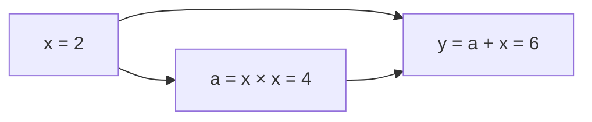

# 06｜微积分、梯度与自动微分

> 先修：函数、向量、矩阵乘法和 Python 类。先学第 1～5 节，手算一条计算图，再运行自动微分与 XOR 实验。此章解释“梯度怎样算”，[优化方法](07-优化方法与凸性条件.md)解释“有了梯度怎样更新”。

## 1. 导数是局部变化率，不是有限步长的承诺

训练时，参数是可以调的变量，损失是要减小的标量。导数回答：在当前位置，只改变一个变量一点点，损失会怎样变化？

$$
f'(x)=\lim_{h\to0}\frac{f(x+h)-f(x)}h,\qquad
f(x+h)=f(x)+f'(x)h+o(h).
$$

例如 $f(x)=x^2$，$f'(2)=4$。从 2 移到 2.01，线性预测的变化是 $4\times0.01=0.04$，实际变化是 $2.01^2-2^2=0.0401$；多出的 0.0001 就是二阶项。切线是 $y=f(x_0)+f'(x_0)(x-x_0)$，只在附近近似曲线。

对 $f(x)=x^3-3x$，导数 $3x^2-3$ 在 $x=\pm1$ 为零。$x=-1$ 是局部极大点，$x=1$ 是局部极小点；“切线水平”不直接等于“找到最小值”。这也是观察切线图时要读出的信息。

常用求导规则：$(f+g)'=f'+g'$，$(fg)'=f'g+fg'$，$(f/g)'=(f'g-fg')/g^2$（分母非零）。

| 函数 | 导数或局部规则 | 条件与用途 |
|---|---|---|
| $x^n$ | $nx^{n-1}$ | 实数幂需检查定义域；平方误差 |
| $e^x$ | $e^x$ | 指数与概率计算 |
| $\ln x$ | $1/x$ | $x>0$；对数似然 |
| $\sin x$ | $\cos x$ | 角度使用弧度 |
| $1/x$ | $-1/x^2$ | $x\ne0$ |
| $\sigma(x)=1/(1+e^{-x})$ | $\sigma(x)(1-\sigma(x))$ | 饱和区导数小 |
| $\tanh x$ | $1-\tanh^2x$ | 在 0 处导数为 1 |
| $\operatorname{ReLU}(x)$ | 正半轴 1，负半轴 0 | 0 处不可微，框架选择约定值 |
| $\operatorname{GELU}(x)=x\Phi(x)$ | $\Phi(x)+x\phi(x)$ | $\Phi,\phi$ 为标准正态分布函数、密度；近似 GELU 的导数不同 |

## 2. 偏导、梯度、Jacobian 与 Hessian 各管什么

对 $f:\mathbb R^d\to\mathbb R$，偏导固定其余坐标，梯度把偏导收集成 $d$ 维列向量：

$$
\nabla f=\begin{bmatrix}\partial f/\partial x_1&\cdots&\partial f/\partial x_d\end{bmatrix}^{\mathsf T}.
$$

对 $f(x,y)=x^2+3xy+y^2$，梯度为 $(2x+3y,3x+2y)$，在 $(1,2)$ 为 $(8,7)$。沿方向 $v$ 的局部变化是 $\nabla f^{\mathsf T}v$。在欧氏单位长度约束 $\|v\|_2=1$ 下，Cauchy–Schwarz 不等式给出最陡上升方向 $v=\nabla f/\|\nabla f\|_2$；换度量或范数时方向可能改变。

向量函数 $F:\mathbb R^n\to\mathbb R^m$ 的 Jacobian 为 $J\in\mathbb R^{m\times n}$，$J_{ij}=\partial F_i/\partial x_j$。例如 $F(x,y)=(xy,x+y)$：

$$
J=\begin{bmatrix}y&x\\1&1\end{bmatrix}.
$$

标量函数的 Hessian 是 $d\times d$ 二阶偏导矩阵 $H_{ij}=\partial^2f/(\partial x_i\partial x_j)$；二阶导连续时对称。上面的 $x^2+3xy+y^2$ 有 $H=\begin{bmatrix}2&3\\3&2\end{bmatrix}$，特征值为 5 与 -1，因此并非凸函数。不能看到“二次式”就认定它是碗形。

在内部驻点 $\nabla f=0$，Hessian 正定可判严格局部极小、负定可判严格局部极大、不定可判鞍点；半正定或有零特征值时通常还需更高阶分析。$x^4$ 和 $-x^4$ 在 0 的二阶导都为零，结论却相反。

## 3. 链式法则：沿路径相乘，多条路径相加

若 $y=f(g(x))$，则 $dy/dx=f'(g(x))g'(x)$；外层导数必须在内层输出处计算。对 $y=(3x+1)^2$，结果为 $6(3x+1)$；对 $y=\sin(ax^2)$，结果为 $\cos(ax^2)\,2ax$，其中 $a$ 固定。画图时先记录 $u=ax^2$，分别读出 $dy/du$ 和 $du/dx$，相乘才是最终梯度。

一个参数可能走多条路径影响损失。对 $y=x^2+x$，平方路径贡献 $2x$，直接路径贡献 1，总梯度 $2x+1$。计算图节点被复用时，反向计算必须用 `+=` 累加，不能后一个梯度覆盖前一个。



反向从 $\partial y/\partial y=1$ 开始：加法分别给 $a,x$ 贡献 1；乘法的两个输入恰好都是同一个 $x$，各贡献 2。最后 $x$ 收到 $1+2+2=5$。图的遍历去重与梯度路径去重是不同的事：节点只执行一次，所有边的贡献仍要累加。

### 线性层的形状检查

单样本 $z=Wx+b$：$x\in\mathbb R^n,W\in\mathbb R^{m\times n},b,z\in\mathbb R^m$。若上游梯度 $g=\partial L/\partial z\in\mathbb R^m$，则

$$
\frac{\partial L}{\partial x}=W^{\mathsf T}g,\qquad
\frac{\partial L}{\partial W}=gx^{\mathsf T},\qquad
\frac{\partial L}{\partial b}=g.
$$

行表示的批量输入 $X\in\mathbb R^{B\times n}$、$Z=XW^{\mathsf T}+b$，则 $dX=dZ\,W$、$dW=dZ^{\mathsf T}X$、$db=\sum_{\text{batch}}dZ$。广播的偏置在反向要沿被广播维度求和；批量损失取平均时，$1/B$ 也应在梯度中出现一次。

## 4. 从线性回归到分类损失

线性回归 $\hat y_i=wx_i+b$，平均平方误差

$$
L=\frac1N\sum_i(\hat y_i-y_i)^2,
\quad\partial_wL=\frac2N\sum_i(\hat y_i-y_i)x_i,
\quad\partial_bL=\frac2N\sum_i(\hat y_i-y_i).
$$

可把三个梯度理解成“误差对预测的影响”“预测对权重的影响”“批量平均”。以下完整程序对 $y=2x+1$ 手写更新，依赖 NumPy：

```python
import numpy as np

x = np.arange(1, 6, dtype=np.float64)
y = 2 * x + 1
w, b = 0.0, 0.0
for step in range(4000):
    error = w * x + b - y
    dw = 2 * np.mean(error * x)
    db = 2 * np.mean(error)
    w -= 0.02 * dw
    b -= 0.02 * db
loss = np.mean((w * x + b - y) ** 2)
print("权重、偏置、损失：", w, b, loss)
assert np.allclose([w, b], [2, 1], atol=1e-6)
```

二分类 $p=\sigma(z)$、$L=-y\log p-(1-y)\log(1-p)$：

$$
\partial_pL=-y/p+(1-y)/(1-p),\qquad
\partial_zL=(\partial_pL)p(1-p)=p-y.
$$

这里 $p-y$ 是**对 logit $z$**的梯度，不能误写成对概率 $p$ 的梯度。多分类 softmax $p_i=e^{z_i}/\sum_j e^{z_j}$ 的 Jacobian 是 $\partial p_i/\partial z_j=p_i(\delta_{ij}-p_j)$，所有输出耦合，不能只保留对角线。与单样本交叉熵 $-\log p_y$ 组合后，$\partial L/\partial z_j=p_j-\mathbf1[j=y]$。log-softmax 的完整导数为 $\partial\log p_i/\partial z_j=\delta_{ij}-p_j$。

正则项 $\lambda\|w\|_2^2$ 贡献 $2\lambda w$；L1 非零坐标贡献 $\lambda\operatorname{sign}(w)$，在 0 处是子梯度集合 $[-\lambda,\lambda]$。稳定的损失计算见[浮点误差与数值稳定](08-浮点误差与数值稳定.md)。

## 5. 数值、解析、符号与自动微分

| 方法 | 怎样算 | 适合什么 | 主要限制 |
|---|---|---|---|
| 解析求导 | 手推规则，写出导数函数 | 理解模型、检查简单损失 | 复杂图容易漏路径 |
| 符号微分 | 对表达式做代数变换 | 推导、数学软件 | 表达式膨胀；不直接等同一般程序执行 |
| 有限差分 | 用附近函数值近似 | 黑盒函数、小规模梯度检查 | 近似误差；逐坐标中央差分需约 $2d$ 次评估 |
| 自动微分 | 记录已执行的基本操作，组合局部导数 | 可微程序的训练 | 仍有浮点误差，且要支持相关操作 |

中央差分为 $(f(x+h)-f(x-h))/(2h)$，对足够光滑函数截断误差 $O(h^2)$；前向差分一般为 $O(h)$。$h$ 太大忽略曲率，太小导致两个值相消或 $x+h$ 根本没有改变。应在 float64 下试数个 $h$，按变量尺度取 $h_i\approx10^{-5}\max(1,|x_i|)$ 作为起点，而非固定一步长万能。

```python
import math

def central(f, x, h=1e-5):
    return (f(x + h) - f(x - h)) / (2 * h)

cases = [(lambda x: x**2, lambda x: 2*x),
         (lambda x: x**3, lambda x: 3*x*x),
         (math.sin, math.cos), (math.exp, math.exp),
         (lambda x: 1/x, lambda x: -1/x**2)]
for f, df in cases:
    assert math.isclose(central(f, 2), df(2), rel_tol=1e-8)
print("五个数值导数与解析导数一致")
```

二阶中央差分为 $\partial_{xx}f\approx[f(x+h,y)-2f(x,y)+f(x-h,y)]/h^2$；混合偏导需扰动两个坐标：

$$
\partial_{xy}f\approx\frac{f(x+h,y+h)-f(x+h,y-h)-f(x-h,y+h)+f(x-h,y-h)}{4h^2}.
$$

可用它构成二维 Hessian，再与解析矩阵核对：对 $x^2-y^2$ 应为 $\operatorname{diag}(2,-2)$，对 $x^2+3xy+y^2$ 应为 $\begin{bmatrix}2&3\\3&2\end{bmatrix}$。二阶差分比一阶更敏感于舍入，先用 $h=10^{-4}$ 或 $10^{-3}$ 做小例子，再扫步长；不要把误差产生的微小负特征值立即解释成真实负曲率。

自动微分是对执行图的链式计算，不是有限差分，也不需要把整条表达式展开。对 $F:\mathbb R^n\to\mathbb R^m$，前向模式传播 $Jv$，反向模式传播 $J^{\mathsf T}u$。求完整 Jacobian 通常前向约需 $n$ 个方向、反向约需 $m$ 个输出种子；训练的输入是很多参数、输出是一个标量损失，所以反向模式合适。它要保存或重算中间值，内存并不自动比前向更少。

## 6. 反向自动微分：可读、可运行的标量引擎

下面原创教学程序只支持标量，演示节点记录、局部导数、拓扑排序和梯度累加。它不是生产框架：无张量广播、无 GPU、无高阶求导，也没有框架的原地修改检查。所有参数更新都放在反向完成之后。

```python
import math

class Value:
    def __init__(self, data, parents=()):
        self.data = float(data)
        self.grad = 0.0
        self.parents = tuple(parents)
        self.pullback = lambda: None

    @staticmethod
    def wrap(x):
        return x if isinstance(x, Value) else Value(x)

    def __add__(self, other):
        other = self.wrap(other)
        out = Value(self.data + other.data, (self, other))
        def back():
            self.grad += out.grad
            other.grad += out.grad
        out.pullback = back
        return out

    __radd__ = __add__

    def __mul__(self, other):
        other = self.wrap(other)
        a, b = self.data, other.data
        out = Value(a * b, (self, other))
        def back():
            self.grad += b * out.grad
            other.grad += a * out.grad
        out.pullback = back
        return out

    __rmul__ = __mul__

    def __neg__(self):
        return self * -1

    def __sub__(self, other):
        return self + (-self.wrap(other))

    def __rsub__(self, other):
        return self.wrap(other) - self

    def __pow__(self, n):
        if not isinstance(n, int):
            raise TypeError("教学引擎的幂仅支持整数指数")
        a = self.data
        out = Value(a ** n, (self,))
        derivative = 0.0 if n == 0 else n * a ** (n - 1)
        def back():
            self.grad += derivative * out.grad
        out.pullback = back
        return out

    def __truediv__(self, other):
        return self * (self.wrap(other) ** -1)

    def __rtruediv__(self, other):
        return self.wrap(other) / self

    def unary(self, f, df):
        a = self.data
        out = Value(f(a), (self,))
        derivative = df(a)
        def back():
            self.grad += derivative * out.grad
        out.pullback = back
        return out

    def tanh(self):
        return self.unary(math.tanh, lambda x: 1 - math.tanh(x)**2)

    def relu(self):
        return self.unary(lambda x: max(0.0, x), lambda x: float(x > 0))

    def exp(self):
        return self.unary(math.exp, math.exp)

    def log(self):
        return self.unary(math.log, lambda x: 1 / x)

    def backward(self):
        order, seen = [], set()
        def visit(node):
            if node in seen:
                return
            seen.add(node)
            for parent in node.parents:
                visit(parent)
            order.append(node)
        visit(self)
        # 此教学版每次重算当前图的导数，不跨调用累加。
        for node in order:
            node.grad = 0.0
        self.grad = 1.0
        for node in reversed(order):
            node.pullback()

x = Value(2)
y = x * x + x
y.backward()
assert (y.data, x.grad) == (6.0, 5.0)
print("重复使用输入的梯度：", x.grad)

expressions = [lambda t: t**3 + 2*t + 1,
               lambda t: (t*t).tanh(),
               lambda t: (t+1)/(t*t+1),
               lambda t: t.exp()*t,
               lambda t: (t*t+1).log()]
for expression in expressions:
    x = Value(0.5)
    output = expression(x)
    output.backward()
    h = 1e-5
    numeric = (expression(Value(0.5+h)).data
               - expression(Value(0.5-h)).data) / (2*h)
    assert math.isclose(x.grad, numeric, rel_tol=1e-7, abs_tol=1e-8)
print("五条计算图通过中央差分检查")
```

拓扑排序先把父节点加入列表，反转后先处理输出。只有一个节点所有下游贡献已经齐全，才向其父节点传播。乘法保留两个父边，所以 `x*x` 会给同一个对象加两次。教学版每次把当前图梯度清零；PyTorch 默认对叶子 `.grad` 累加，训练要调用 `optimizer.zero_grad()`，两者行为不能混淆。

### 用同一个引擎训练 XOR

XOR 的四点标签为 $(-1,1,1,-1)$，单个线性分界不能拟合；加入 tanh 隐层后可以。下面代码**接着前一个完整程序运行**，每个神经元是一组权重加一个偏置，每层是一组神经元，网络逐层调用。

```python
import random

rng = random.Random(7)
sizes = [2, 4, 1]
layers = [[([Value(rng.uniform(-1, 1)) for _ in range(nin)], Value(0))
           for _ in range(nout)] for nin, nout in zip(sizes, sizes[1:])]
parameters = [p for layer in layers for weights, bias in layer
              for p in weights + [bias]]

def predict(features):
    values = features
    for layer in layers:
        values = [sum((w*x for w, x in zip(weights, values)), bias).tanh()
                  for weights, bias in layer]
    return values[0]

features = [[0, 0], [0, 1], [1, 0], [1, 1]]
targets = [-1, 1, 1, -1]
for step in range(1200):
    loss = sum((predict(x)-y)**2 for x, y in zip(features, targets)) / 4
    loss.backward()
    for p in parameters:
        p.data -= 0.1 * p.grad
predictions = [predict(x).data for x in features]
print("XOR 预测：", [round(p, 3) for p in predictions])
assert all(p*y > 0 for p, y in zip(predictions, targets))
assert loss.data < 0.01
```

四点全部同号判断正确才算学到 XOR；损失下降但某个点分错不能算成功。固定随机种子用于复现这个算例，不证明所有初始化都收敛。每轮重建前向图，使本轮梯度对应本轮参数。

## 7. 前向模式与双数

双数 $a+b\epsilon$ 满足 $\epsilon^2=0$，它的第二项保存当前方向的导数：乘法为 $(a,a')(b,b')=(ab,a'b+ab')$，正是乘积法则。它与 $i^2=-1$ 的复数不是同一种数。

```python
import math
from dataclasses import dataclass

@dataclass
class Dual:
    value: float
    tangent: float = 0.0

    @staticmethod
    def wrap(x):
        return x if isinstance(x, Dual) else Dual(x)

    def __add__(self, other):
        other = self.wrap(other)
        return Dual(self.value + other.value, self.tangent + other.tangent)

    __radd__ = __add__

    def __mul__(self, other):
        other = self.wrap(other)
        return Dual(self.value * other.value,
                    self.tangent * other.value + self.value * other.tangent)

    __rmul__ = __mul__

    def sin(self):
        return Dual(math.sin(self.value), math.cos(self.value) * self.tangent)

x = Dual(2.0, 1.0)
y = (x*x).sin()
assert math.isclose(y.tangent, 4 * math.cos(4), abs_tol=1e-12)
print("前向导数：", y.tangent)  # 约 -2.614574483
```

把输入方向种子从 1 改成 3，会得到原导数的 3 倍；双数计算的是方向导数，而不是每次都自动得到完整梯度。

## 8. Taylor 与积分把局部计算连到总体目标

二阶 Taylor 局部近似：

$$
f(x+s)\approx f(x)+\nabla f(x)^{\mathsf T}s+\tfrac12s^{\mathsf T}H(x)s.
$$

梯度下降可视为最小化“一阶模型加移动代价” $\nabla f^{\mathsf T}s+\|s\|^2/(2\eta)$，导数为零得 $s=-\eta\nabla f$。只最小化无约束线性模型通常没有有限最小值。正定 Hessian 下，二阶模型的极小点给 Newton 步。充分光滑只保证合适的有限阶展开与余项；无限 Taylor 级数恰好等于函数需要更强条件，不能把“光滑”直接等同“解析”。

在 0 附近，$\sin h\approx h$，二阶项恰好为零，所以加二阶项并不改善；第三阶 $h-h^3/6$ 才增加信息。$e^h\approx1+h+h^2/2$ 在 $h=0.1$ 给 1.105，与真实约 1.105170 接近；在 $h=2$ 给 5，与真实约 7.389 相差明显。这说明局部模型不能被随意用于远距离步长。

积分累积连续量。若 $p(x)$ 是概率密度，$P(a<X<b)=\int_a^b p(x)dx$，期望 $\mathbb E[f(X)]=\int f(x)p(x)dx$。训练的平均损失是分布期望风险的经验近似；KL 为 $\int p\log(p/q)$，需注意支持集和积分是否有限。Bayes 后验归一化常数为 $\int p(D\mid\theta)p(\theta)d\theta$，高维时难直接积分，接入[蒙特卡洛与采样](../03-数值优化-蒙特卡洛与采样.md)。softmax 的有限离散求和与连续积分要区分。

## 9. 使用真实框架时的排错顺序

1. 核对损失对谁求导，平均与求和是否一致，梯度形状是否与参数一致。
2. 查看参数是否启用梯度；`.item()`、`.detach()`、转到 NumPy 后重建张量可能断开连接。
3. 查看是否正确清零梯度，是否修改了反向仍需的中间值；更新参数应发生在反向之后。
4. 不能用“argmax、整数索引、取整会自动提供有效梯度”理解框架。可微分支只沿实际执行路径求导，离散选择一般不对其选择索引求导；重参数化或直通估计是需单独论证的估计方法。
5. 在 float64 小例子上做梯度检查，暂关 dropout 等随机操作，避免 ReLU 恰在 0 或最大值并列点。近零梯度同时看绝对误差，不能只看相对误差。

PyTorch `backward()` 对标量输出可默认种子 1；向量输出要给同形状种子，计算向量–Jacobian 乘积。动态图按本次执行重建；`model.eval()` 改变 dropout/BatchNorm 行为，但本身不关闭自动微分。CPU 数学实验已运行，PyTorch API 只核对了官方文档，本章未安装或运行 PyTorch。

## 10. 检查题与实践验收

1. $y=\operatorname{ReLU}(w_1x_1+w_2x_2+b)$，取 $(w_1,w_2,x_1,x_2,b)=(2,-1,3,1,0.5)$，求五个梯度。**答案：**预激活 5.5 为正，依次为 $(3,1,2,-1,1)$；负预激活时全为零，0 处按选择的约定处理。
2. $x^3$ 在 2 处二阶导是多少？用 $(f(x+h)-2f(x)+f(x-h))/h^2$ 核对。**答案：**12；二阶差分也会受步长与舍入影响，不宜反复嵌套极小步长的一阶差分。
3. 最小化 $(x-3)^2+(y+1)^2$，从 $(0,0)$ 以 $\eta=0.1$ 更新。**答案：**首步 $(0.6,-0.2)$，理论每步误差乘 0.8，极限 $(3,-1)$。
4. 将 $x$ 重复输入引擎算 $x^3$，在 2 处应得到 12；`tanh'(0)=1`、`tanh'(2)\approx0.0706508`。若复用输入测试失败，应先查累加与拓扑顺序。
5. 对一个 $3\times2$ 权重矩阵和三维偏置，使用标量损失 $\tfrac12\|Wx+b\|_2^2$ 检查导数。**答案：**$dW=(Wx+b)x^{\mathsf T}$，$db=Wx+b$；逐个扰动六个权重和三个偏置，应与中央差分在合理容差内一致。
6. 训练 XOR 后改变一个隐层权重，观察四个预测，再解释前向值与梯度为什么要重算。**验收：**能跑、能手算重复路径、能扩展一种操作并做差分核对；仅复制日志不算掌握。

## 来源与核验

- 整理日期：2026-10-03。AI Engineering from Scratch，`phases/01-math-foundations/04-calculus-for-ml` 与 `05-chain-rule-and-autodiff`；基准提交 `3be078b37ffd8f0c04953c0678e48f5c6d0c7775`。[来源仓库](https://github.com/rohitg00/ai-engineering-from-scratch)。阅读正文、Python/Julia 实现、quiz、计算图与切线图表达；只吸收知识与练习，未复制来源技能指令或生成物。
- 自动微分执行图、非光滑点、梯度累加与原地操作依据 [PyTorch Autograd mechanics](https://docs.pytorch.org/docs/stable/notes/autograd.html)，2026-10-03 核对。
- 旧主干的梯度、积分、Taylor 桥梁与本章去重；此章保留完整学习推导和实验，主干负责应用导航。
