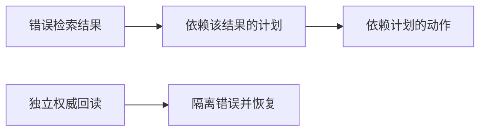

# 第 12 章：异常处理和恢复

> 来源：<https://adp.xindoo.xyz/chapters/>  
> 整理语言：中文  
> 整理更新：2026-10-02；含原理、教学例子与自检。示例不是生产部署验收。

## 本章定位

识别执行失败、工具错误与环境异常，并通过重试、回退、替代方案等方式恢复。

## 先分清失败类型

临时网络错误可有限重试；参数错误应修参数；鉴权失败应处理身份/权限；业务拒绝需解释原因；状态未知的写操作要先查询执行结果。把所有错误都重试，会造成重复写入、限流加剧和成本浪费。

重试应有限次数、指数退避和抖动，并遵守服务返回的等待信息。长任务保存检查点与任务 ID；事件处理记录去重键，避免相同通知重复触发副作用。

## 具体例子：创建记录后超时

客户端发送“创建条目”，服务器已创建，但响应丢失。此时再次发送相同创建请求可能得到两条记录。可先使用同一个幂等键查状态或重试，由服务保证重复键只产生一个结果；如果服务不支持，就按唯一业务标识回读，无法确认时报告状态未知。

故障切换也要保留模型/模板差异：备用模型能连通，不代表工具调用语义完全相同。恢复后重跑关键校验，而不是直接宣称原任务成功。

## 自检与核对

**问题**：HTTP 超时说明服务器一定没执行吗？

**核对**：不说明。它只说明客户端未及时取得结果。读请求通常可重试，写请求必须结合幂等性和状态核对来恢复。

## 来自《深入理解 AI Agent》的增量吸收

- 异常恢复应覆盖模型调用、工具调用、文件修改、外部服务和长任务执行，而不是只捕获程序异常。
- Coding Agent 的恢复思路包括验证修改结果、重试、重新定位、替代工具/模型以及供应商故障切换。
- 异步 Agent 还需要处理事件重复、超时、乱序、状态丢失和中断恢复。
- 失败轨迹应进入评估与回归集，避免同类故障反复出现。

完整来源：[第 5 章 Coding Agent](../05-来源保全/深入理解%20AI%20Agent/source/book/chapter5.md) · [第 6 章 交互](../05-来源保全/深入理解%20AI%20Agent/source/book/chapter6.md) · [第 7 章 Agent 的评估](../05-来源保全/深入理解%20AI%20Agent/source/book/chapter7.md)

## 用目标、轨迹与真实效果诊断失败

2026-10-09 吸收固定来源 Phase14 第 26 课。程序没抛异常只说明运行路径没有触发相应异常；一个合法 JSON 仍可能选错对象、违反范围、引用错误证据或谎报完成。先记录用户目标、允许对象与动作、预定后置条件，再记录模型提议、工具调用/参数、状态回读和终态。观察到的迹象、已验证的失败与根因假设应分开写。

源教学归纳的五类是幻觉动作、范围漂移、错误级联、上下文丢失与工具误用，源码还另加“成功幻觉”。这些是排查入口，允许一条轨迹有多个标签，并非所有失败的穷尽集合。例如版本错配也会造成失败，即使不在这五标签中。不要把重叠标签计数相加当成 100% 覆盖率。

| 排查入口 | 可观察证据 | 易混淆的良性情况与验证方法 |
| --- | --- | --- |
| 幻觉动作 | 调用不存在或在此 runtime 不可用的工具；声称执行但没有调用/回执 | 固定 `KNOWN_TOOLS` 不等当前授权目录，先核注册版本与可用能力 |
| 范围漂移 | 实际对象/动作不在已授权任务内 | “do not write”含 write 不能当写授权；中文、隐含可逆实施与具体对象须结合任务合同 |
| 错误级联 | 错误值经依赖边进入其他决策、调用或系统 | 错误之后正常重试/独立查询不一定受影响；看数据与控制依赖 |
| 上下文丢失 | 明确约束、先前确认或状态在后续选择中未被保留 | 关键词检测只能报告迹象，不能证明模型内部“忘记”；恢复压缩后的关键约束与状态版本 |
| 工具误用 | 参数类型/语义、额外参数、目标权限或调用时机不合合同 | schema 合法不代表业务正确，核对象 ACL、语义、前置条件与副作用 |
| 成功幻觉 | 宣称完成，但承诺的后置条件未满足或没有足够证据 | 只读任务可无状态变化；幂等设置已满足目标也可成功，不强制 `changed=True` |

源 detector 是粗签名：`do not` 后取第一个词再查参数，会把 “do not modify src” 提成 modify，而真实写参数只有 src 时漏检；空的 “do not” 会索引异常。参数 key 子集检查漏类型/额外字段/授权；某 error 后任意两次 call 的规则把正常恢复误判级联。维护时给每项增加相似良性负例和边界输入，测漏报/误报；不把 Counter 分布称为真实 trace 聚类。

## MAST：14 个模式的具体含义

这里依据 [MAST v3 Appendix A](https://arxiv.org/html/2503.13657v3#A1) 的定义作简洁中文概括，例子为自写假业务场景。v1 使用 MASFT 名称，v3 使用 MAST；类别为系统设计 5 项、Agent 间失配 6 项、任务验证 3 项，共 14 项。第三类只有 3 项，“每类至少 4 项”的原教学目标应纠正。

| 类别与编号 | 核心含义 | 便于核对的假例子 |
| --- | --- | --- |
| 系统设计 1.1 | 未遵守任务约束/要求 | 只允许汇总公开资料，却加入私人附件内容 |
| 系统设计 1.2 | 未遵守角色职责/边界 | 审查者本应只给意见，却直接覆盖作者文件 |
| 系统设计 1.3 | 无必要重复已经完成的步骤 | 已有有效回执，仍反复创建同一条目 |
| 系统设计 1.4 | 丢失会话历史或回到较早状态 | 最新确认排除 A，恢复后仍按旧候选含 A 执行 |
| 系统设计 1.5 | 未识别应终止条件 | 全部目标通过验收后继续工具循环直到预算耗尽 |
| Agent 间失配 2.1 | 无必要重启对话 | 子任务尚未结束，协调者丢弃已有上下文重新问同一任务 |
| Agent 间失配 2.2 | 信息不清/不全时未澄清便行动 | 缺少应修改的版本却直接改猜测版本 |
| Agent 间失配 2.3 | 偏离原目标 | 任务是修一个 bug，协作逐步转为无关全站重构 |
| Agent 间失配 2.4 | 有重要信息却未传给需要方 | 查询者已知数据过期，却未通知依赖其结论的汇总者 |
| Agent 间失配 2.5 | 未适当考虑其他 Agent 输入 | 审查者给了可复现反例，作者仍按未被反驳的原结论继续 |
| Agent 间失配 2.6 | 所述推理/计划与实际动作不一致 | 说明只会读取，实际发出写请求 |
| 任务验证 3.1 | 目标未满足就过早终止 | 把提交成功当作全部异步任务完成 |
| 任务验证 3.2 | 没验证或验证不完整 | 只检查生成文件存在，未检查内容与链接 |
| 任务验证 3.3 | 验证/交叉核对方式错误 | 用模型自己编造的参考答案核模型输出 |

相同症状可能有不同来源：目标漂移可能是角色约束弱，也可能是消息丢失、压缩损失、模型理解错误。分类不是自动根因裁决。原论文 §4 讨论系统结构与协调/验证的可改进空间，同时承认基础模型能力局限会造成失败；不能教成“所有失败纯设计问题，升级基础模型毫无作用”。标注一致性如 Cohen's κ 反映特定样本与协议下的标注一致，不证明分类涵盖所有失败或推断具有因果效力。

[Agent 幻觉综述 v2 §III-A](https://arxiv.org/html/2509.18970v2) 中 instruction/context 两点是意图理解局限的表现：未适当理解/遵从指令，以及前文上下文的忘记/误用。综述还讨论感知、推理与动作方面，不能把这两点写成全部 Agent 幻觉分类，也不能把 system 与 user 指令层级混成同一种授权。

## 级联半径需要因果图

令有向无环图中的边 $u\to v$ 表示步骤 $v$ 使用步骤 $u$ 的输出或依赖其控制决定。可达后继集合给出**潜在影响范围**；真正影响还需确认错误数据是否被采纳、是否被纠正，以及最后效果。可报告受影响步骤/对象/系统数、持续时间、额外成本与不可逆损失，不能只取时间上晚于错误的行数。



### CPU 实验：潜在级联与后置条件

完整标准库程序用内存 DAG 模拟错误步骤、两个依赖后继和独立恢复。`descendants` 给潜在影响集，`consumed_bad` 是本 fixture 已观察到使用错误输入的步骤；两者分开。图按拓扑顺序构造，拒绝未知/前向依赖，从而不把循环图当 DAG。三个状态例核只读成功、幂等成功和谎报写成功。

```python
from dataclasses import dataclass

@dataclass(frozen=True)
class Step:
    name: str
    parents: tuple[str, ...]
    consumed_bad: bool = False

steps = [Step('bad_retrieve', ()), Step('plan', ('bad_retrieve',), True),
         Step('act', ('plan',), True), Step('authority_read', ()),
         Step('recover', ('authority_read',))]

def build_graph(items):
    graph = {}
    for step in items:
        if step.name in graph or any(parent not in graph for parent in step.parents):
            raise ValueError('重复、未知或非拓扑顺序依赖')
        graph[step.name] = set()
        for parent in step.parents:
            graph[parent].add(step.name)
    return graph

def descendants(graph, start):
    if start not in graph:
        raise ValueError('未知根步骤')
    seen, todo = set(), list(graph[start])
    while todo:
        item = todo.pop()
        if item not in seen:
            seen.add(item)
            todo.extend(graph[item])
    return seen

graph = build_graph(steps)
potential = descendants(graph, 'bad_retrieve')
confirmed = {s.name for s in steps if s.name in potential and s.consumed_bad}
assert potential == confirmed == {'plan', 'act'}
assert 'recover' not in potential  # 晚到的恢复不是错误数据的后继
try:
    build_graph([Step('a', ('b',)), Step('b', ('a',))])
except ValueError:
    pass
else:
    raise AssertionError('循环不能伪装成 DAG')

cases = [('readonly', {'value': 7}, {'value': 7}, {'value': 7}),
         ('idempotent', {'flag': True}, {'flag': True}, {'flag': True}),
         ('false_success', {'flag': False}, {'flag': False}, {'flag': True})]
verdict = {}
for name, before, observed, required in cases:
    changed = before != observed
    verified = observed == required
    verdict[name] = (changed, verified)
assert verdict == {'readonly': (False, True), 'idempotent': (False, True),
                   'false_success': (False, False)}
print('potential', sorted(potential), 'confirmed', sorted(confirmed), 'radius', len(confirmed))
print('changed_and_postcondition', verdict)
```

2026-10-09 从最终正文提取运行；它验证 fixture 中的依赖遍历与明确后置条件，未执行真实工具、未发现真实因果关系，也没有观测外部服务。生产系统需记录 input lineage、任务/调用 ID、版本与回执；状态未知不能当成功。幂等与回读证据接[案例方法论](../../LLM%20工程实践/10-案例方法论.md)，重试与持久状态接[MCP 通信与状态工程](../06-专题扩展/06-MCP通信与状态工程.md)。

源静态 `failure-modes.svg` 可用于区分排查入口；动态图 `failure-cascade` 四节点按预设时间变色和闪电传播，没有依赖数据、实际 detector 或严重度计算，不能证明每个后续步骤都受影响。真正的检测应在关键权限/状态/事实边界配置相应判据，不要求所有推理 token 都运行昂贵 judge。

## 第 26 课练习：参考判据

1. **增加“成功但状态未变”检测。** 原源码已有 detector，本题应改进它。用只读成功、幂等已满足、未达目标却说完成三组反例，核预定后置条件与独立 receipt，不单靠 `state_changed`。
2. **标注 100 条真实轨迹，哪类主导？** 本批未采真实轨迹。实践时匿名化并分层抽样，保标签定义版本、重叠标签、分母、严重度与修复成本。高频不等高损失，采样产品不能外推整个行业。
3. **实现级联半径。** 构造依赖 DAG，报告潜在后继与已确认影响，独立恢复作为负例；必要时报告跨系统对象、时长与费用。时间顺序不能替因果证据。
4. **从 14 模式选三种写 detector。** 在固定 v3 定义下挑业务相关模式，给可观察判据、正常负例和人工复核；规则/模型 judge 各自校准，不声称三种规则自动覆盖全 14 类。
5. **CI 中至少 5% 被标记就失败。** 5% 是练习策略，先决定严重失败是否一例即阻断、分母是轨迹还是调用、未知如何处理。固定同版本回归/留出 gold，测误报及不确定性，再实际部署 gate；本批未部署 CI。

## 第 26 课自检：七题与答案

1. **MAST 的核心论点可否说成基础模型扩展不能解决任何失败？** 不可。系统设计、协调与验证是重要改进方向，模型能力也会影响失败；二者互补。
2. **embedding 版本错配属于源五标签吗？** 不是该五标签的直接项目，但可造成真实失败。标签表的范围不能排除现实风险。
3. **怎样确认级联错误？** 核错误沿数据/控制依赖被后续步骤采纳并产生后果；发生在 error 之后还不足以成立。
4. **指令与上下文两表现是全部幻觉吗？** 不是，它们属于该综述意图理解部分；还要看感知、推理与动作。
5. **什么是成功幻觉？** 未满足承诺目标却宣称成功，或缺证据却断言完成；“未改变状态”本身不是充分条件。
6. **为什么只监控 crash 不够？** 格式合法与进程存活仍可业务失败，要核目标、内容、权限和效果；本源合成样本不能证明“多数”失败比例。
7. **每一步都必须同一种 classifier 吗？** 不必。关键边界采用参数/权限校验、可信证据和状态回读；按风险选择 gate 并记录失败，任何单一 gate 都不保证完全安全。

来源：`rohitg00/ai-engineering-from-scratch` 固定 `3be078b37ffd8f0c04953c0678e48f5c6d0c7775`，`phases/14-agent-engineering/26-failure-modes-agentic`。本批课内全读与图示静态阅读有独立准备证据；一手核验仅包括 MAST v3 §4 与 Appendix A、上述综述 §III-A 相关定义，不称整论文已读。原源码/SDK/模型、100 条真实 trace、真实告警与 CI 未运行。


## 长期任务的恢复：重放决策，核对外部效果

把长期流程拆成 deterministic **workflow** 与可能不确定/失败的 **activity**。workflow 决定依赖、分支、等待和结束；activity 承担模型请求、工具、外部I/O。完成结果进入持久history，恢复时重建决策状态并读取已记录结果，不在workflow内部重新随机、查墙钟或访问外部状态。引擎提供的时间/随机或side-effect记录API必须按具体版本用；temperature=0也不使服务跨版本永远相同。

**已经进入完成 history 的activity，与“可能执行但完成记录没到达”的activity不同。** 后者仍可能重试并再收费/产生效果；event log不能替目的端实现exactly-once。按[Temporal官方幂等说明](https://temporal.io/blog/idempotency-and-durable-execution)与[tasks语义](https://docs.temporal.io/tasks)于2026-10-09核对，通常activity retry是至少一次，需要目的端幂等；关闭retry的至多一次也可能零次，不自动保证成功。幂等身份要包含租户/run/业务operation或逻辑step及版本，不用只有函数名＋args把两次合法同参数调用错误合并。

| 持久对象 | 应保存什么 | 不代表什么 |
| --- | --- | --- |
| workflow history/checkpoint | 状态、版本、已完成结果、待输入、未决效果 | 所有语句任意时刻都可恢复 |
| activity/operation ledger | 参数digest、key、attempt、pending/receipt/unknown | pending已经执行完成 |
| approval | 具体候选/对象版本、审阅人、授权范围与期限 | 两天后环境变化仍可直接沿用 |
| 租约与fencing | worker身份、期限、递增epoch及写端验证 | TTL到了旧worker就不可能继续写 |

[LangGraph checkpointers](https://docs.langchain.com/oss/python/langgraph/checkpointers)在super-step边界保存完整state，并有同step成功task的pending writes；`sync`下一步前保存，`async`有crash未保存窗，`exit`中途不保存。与[人机协同](13-人机协同.md)已有状态机配合理解；不能称所有框架均每个图变化同步写PostgreSQL。SQLite文件在持久磁盘可跨进程恢复，是否适合多host是另一问题；Redis须按持久/复制配置核故障目标；Durable Object内存与storage不同，进程生命周期不决定存储保留期。存储也需租户ACL、备份、加密、schema/code迁移和保留策略。

源第12课JSON event log是单进程读全量再覆盖，无锁/fsync/原子替换；按name＋args找first done会折叠同参数的不同活动，args里tuple/nested shape转JSON后也可能比不一致；没有durable等待、真正并发隔离或目的端幂等。crash发生在两次activity完成之后，静态推导naive共5次start、durable共3次start，只说明此预设路径。源“35min阈值/时长翻倍失败四倍”不受其所引[Anthropic研究](https://www.anthropic.com/research/measuring-agent-autonomy)支持：该研究区分现实turn时长与METR人工解题难度，不是统一运行上限。不要用它规定每35分钟重新批准。

### Phase15 第12课练习参考

1. **改变crash点。** after1时naive总4start、durable总3；after2时5/3，均来自控制流推导而非本批源实跑。新增effect已发生但done未写的窗口，会暴露源未保护的重试风险。
2. **两会话隔离。** key至少有tenant/run/logical step，存储访问鉴权且并发写原子。独立thread_id标签不会让共享JSON read-modify-write避免丢写。
3. **非确定性决策。** 首次根据wall clock选分支，恢复读新时间会变；把结果交history或用引擎确定性时间API。workflow版本改变也需要兼容/迁移，不靠结果缓存掩盖差异。
4. **runtime保存什么？** 运行输入/图状态、已完成活动、pending写/调用、waiting approval、budget、版本与receipt各覆盖不同失败；原博客不是所有系统自动有这些字段的承诺，按真实实现列inventory。
5. **6小时编码任务checkpoint。** 以可验收步骤、候选版本、外部效果和人工等待为边界；恢复先查unknown与租约/权限/候选变化、预算和新依赖，再继续。无变化且既有授权有效，不强制每次crash都再问。

## 熔断、停止开关与canary：停止新动作并保留事故证据

成本限制挡花费，不一定挡一次低价破坏动作。**Kill switch**由Agent无写权限的控制面维护，在实际动作dispatch边界执行；开关读取失败如何处理要明确，高后果默认停止新动作。它应停止或撤销可控制的权限/出站/任务，不保证已发出的动作被撤销。由可信观察器继续记录停止原因和未决效果，不能把源“停止后连日志都不写”当安全原则。

普通服务circuit breaker有closed→open→half-open：触发后暂时挡特定依赖，冷却后有限探测，成功再closed，失败再open。安全隔离是另一种控制，可以要求人工重启，不与服务可用性breaker的自动half-open混为一谈。阈值根据真实失败/负载与风险选择，5次相同不是普遍正确，source“超过10总太宽”无统计依据。

Canary/honeytoken是正常任务无理由接触的假凭据、哨兵对象或文件，访问/回显是告警线索，不是已经证明恶意意图；备份/索引等合法程序也可能访问。用无真实权限、独立可观察、带identity的token，不把真实secret当诱饵，也不因Agent能改某工作区就断言外部monitor失效。统计检测可看EWMA/CUSUM，但适应速度可能被慢漂移利用；硬授权/出站/量级上界由执行器落实，写一条“constitutional”文本不能变硬限制。

[Cilium网络政策](https://docs.cilium.io/en/stable/security/network/)和[egress gateway](https://docs.cilium.io/en/stable/network/egress-gateway/egress-gateway/)区分筛选允许/拒绝与经特定节点路由、SNAT。后者不是默认把任意目标改成蜜罐；官方还指出新pod有策略生效delay、早期包可未经过gateway。需要隔离时先真实deny或撤权限，取证环境用去敏数据和明确路由，测trigger→enforcement→最后未阻断包，而非用datapath P99或源SVG“500ms”保证零泄露。此处不部署网络政策。

### 完整离线例：独立观察与特定路径breaker

源第14课重复从总第3次开始，第7次遇第5个相同调用就break，所以第9次canary不可达；例中也没有实现half-open或真实外部ACL。新例分别验证breaker、half-open探测、canary和kill，避免一个demo的提前结束把另一个控制藏起来。内存只是状态模拟，外部日志/权限独立需生产真实实现。

```python
class Breaker:
    def __init__(self, threshold=3, cooldown=10):
        if type(threshold) is not int or threshold < 1 or type(cooldown) is not int or cooldown < 1:
            raise ValueError('正整数配置')
        self.threshold, self.cooldown = threshold, cooldown
        self.state, self.failures, self.until, self.probing = 'closed', 0, 0, False
        self.now, self.inflight = 0, False
    def clock(self, now):
        if type(now) is not int or now < self.now:
            raise ValueError('单调非负整数时钟')
        self.now = now
    def admit(self, now):
        self.clock(now)
        if self.inflight: return False
        if self.state == 'open':
            if now < self.until: return False
            self.state = 'half_open'
        if self.state == 'half_open':
            if self.probing: return False
            self.probing = True
        self.inflight = True
        return True
    def record(self, now, success):
        self.clock(now)
        if type(success) is not bool: raise ValueError('明确bool结果')
        if not self.inflight: raise ValueError('未准入结果')
        self.inflight = False
        if self.state == 'open' or (self.state == 'half_open' and not self.probing):
            raise ValueError('没有已准入调用')
        if success:
            self.state, self.failures, self.probing = 'closed', 0, False
        else:
            self.failures += 1
            if self.state == 'half_open' or self.failures >= self.threshold:
                self.state, self.until, self.probing = 'open', now + self.cooldown, False

b = Breaker()
for t in (0, 1, 2):
    assert b.admit(t); b.record(t, False)
assert b.state == 'open' and not b.admit(11)
assert b.admit(12) and not b.admit(12)  # 只准入一个probe
b.record(12, False)
assert not b.admit(21) and b.admit(22)
b.record(22, True); assert b.state == 'closed'
try: b.record(22, True)
except ValueError: pass
else: raise AssertionError('未准入/重复结果不可消费')
assert b.admit(22)
try: b.record(True, True)
except ValueError: pass
else: raise AssertionError('结果时钟不可为bool')
b.record(22, True)
try: b.record(22, False)
except ValueError: pass
else: raise AssertionError('同一结果只能消费一次')
for bad in (True, -1, 21):
    try: b.admit(bad)
    except ValueError: pass
    else: raise AssertionError('拒绝bool/倒退时钟')
# 另一条不使用该依赖的路径不被此breaker拦住。
trusted_audit = []
canary_paths = {'/fixture/never-needed'}
def gate(path, killed):
    if type(killed) is not bool: raise ValueError('明确开关状态')
    if killed:
        trusted_audit.append(('halted', path)); return False
    if path in canary_paths:
        trusted_audit.append(('canary-access-attempt', path)); return False
    return True
assert gate('/fixture/report', False)
assert not gate('/fixture/never-needed', False)
assert not gate('/fixture/report', True)
assert [e[0] for e in trusted_audit] == ['canary-access-attempt', 'halted']
print('依赖breaker/单probe/重开与恢复、独立canary、kill后的可信审计均通过；无真实文件读写')
```

### Phase15 第14课练习参考

1. **源turn5与canary9？** 第5个重复是总第7，break后第9没运行；应把canary设独立case，上例明确两个控制都可观察。源EXTERNAL dict不等不可写控制面。
2. **慢漂移。** 比较固定健康基线与允许适应的EWMA、对累积/速率设绝对上界，再做正常季节变化和缓慢异常两组。算法未报警不等每个EWMA都必漏；阈值与学习率须披露。
3. **三个browser canary。** 非正常资料中的假秘密、独立不可写对象访问、禁止持久记忆sentinel回显；分别监控attempt与输出、关联来源。正常任务本来要读取的对象不适合作不应访问的诱饵。
4. **隔离流。** selector定位受影响身份→deny/撤凭据/停止dispatch→确认enforcement→受控环境取证，独立报警；egressgateway路由/SNAT本身非任意目的重写，延迟测控制面/节点/连接与在途，不给500ms通用承诺。
5. **重启。** 有权限的人核原因、unknown/已发生效果、修复版本和回归，再恢复确切权限/预算；日志可见，Agent不可自行取消安全隔离。普通依赖breaker可自动probe，其policy与安全kill不同。

## Checkpoint、目的端幂等和补偿不能互相替代

原第16课预写`committed`再执行：状态写完但动作前crash，恢复把committed当终态便**永久漏执行**；动作后crash又跳过verify。把记录改成“动作后写”则有双执行窗。正确思路不是二选一，而是先持久化`executing`意图，再以同目的端key执行/核receipt，最终按证据标verified；receipt无法确认时保持unknown，禁止盲目重发。重复key＋不同参数必须拒绝，不能只看txid跳过任意amount。

前置条件（对象版本、余额/权限等）必须在真正写入点与写同事务/CAS执行；提议时核过不够。先看同key目的端已知receipt再处理“尚未执行”的条件，因为第一次执行本身可能使原条件改变。租约到期需fencing拒绝旧worker，只有TTL和本地状态检查仍可双写。单`last_transfer_id`不是持久逐操作receipt，其他合法事务会覆盖它。

**回读失败可能是未知，而不是已知坏状态。** 服务响应丢失、eventual read或缓存过期时先reconcile；不要未经证据自动逆操作。已知错误且可逆时，补偿也需要稳定operation ID、幂等、权限与当前对象版本。恢复整个old snapshot会覆盖别人的合法更新；例如原写revision2后他人写revision3，不能把文档全部改回revision1。邮件纠正是新的通信，不撤回已被读的邮件；backup回恢复可能有数据丢失窗口。不可逆动作的限制必须在提议中明确。

### 完整离线例：分离workflow状态和目的端receipt

两个临时SQLite分别模拟workflow日志与强一致的目标服务。目标把“操作key、参数摘要、版本CAS、效果和receipt”放在**同一目标数据库事务**中；本程序因此能安全处理意图前后、effect前后crash。它没有网络、真实邮件或支付，也没有模拟最终一致查询；真实目的端若不提供相同合同，unknown必须停待核，不能套用“查不到便重发”。补偿只在receipt对应版本仍当前时执行，遇后续写保留manual-required。

```python
import hashlib, json, sqlite3, tempfile
from pathlib import Path

def digest(data):
    return hashlib.sha256(json.dumps(data, sort_keys=True, allow_nan=False).encode()).hexdigest()
class Target:
    def __init__(self, path):
        self.db = sqlite3.connect(path)
        self.db.executescript('CREATE TABLE IF NOT EXISTS doc(id TEXT PRIMARY KEY,val TEXT,rev INTEGER);'
                             'CREATE TABLE IF NOT EXISTS receipt(op TEXT PRIMARY KEY,sha TEXT,body TEXT);')
        with self.db: self.db.execute("INSERT OR IGNORE INTO doc VALUES ('x','old',0)")
    def receipt(self, op):
        row = self.db.execute('SELECT sha,body FROM receipt WHERE op=?',(op,)).fetchone()
        return None if row is None else (row[0],json.loads(row[1]))
    @staticmethod
    def validate(op, payload):
        if type(op) is not str or not op or type(payload) is not dict or set(payload) != {'value','expected'}:
            raise ValueError('唯一非空operation和闭合参数')
        if type(payload['expected']) is not int or payload['expected'] < 0 or type(payload['value']) is not str:
            raise ValueError('非负整数版本与文本')
    def apply(self, op, payload):
        self.validate(op, payload)
        sig = digest(payload)
        with self.db:
            old = self.receipt(op)
            if old:
                if old[0] != sig: raise ValueError('同operation不同参数')
                return old[1]
            value, rev = self.db.execute("SELECT val,rev FROM doc WHERE id='x'").fetchone()
            if type(payload['expected']) is not int or payload['expected'] != rev:
                raise ValueError('前置版本冲突')
            if type(payload['value']) is not str: raise ValueError('文本参数')
            rec = dict(before=value,after=payload['value'],revision=rev+1)
            self.db.execute("UPDATE doc SET val=?,rev=? WHERE id='x' AND rev=?",(rec['after'],rev+1,rev))
            self.db.execute('INSERT INTO receipt VALUES (?,?,?)',(op,sig,json.dumps(rec)))
            return rec
    def snapshot(self):
        return self.db.execute("SELECT val,rev FROM doc WHERE id='x'").fetchone()
    def compensate(self, op):
        original = self.receipt(op)
        if original is None: return 'unknown'
        rec = original[1]
        comp = op + ':compensation'
        if self.receipt(comp): return 'compensated'
        if self.snapshot() != (rec['after'],rec['revision']): return 'manual-required'
        self.apply(comp, dict(value=rec['before'],expected=rec['revision']))
        return 'compensated'
class Workflow:
    def __init__(self,path):
        self.db=sqlite3.connect(path)
        self.db.execute('CREATE TABLE IF NOT EXISTS state(op TEXT PRIMARY KEY,sha TEXT,status TEXT)')
    def run(self, target, op, payload, crash=None):
        target.validate(op,payload)
        if crash not in (None,'before-effect','after-effect'):raise ValueError('未知crash注入')
        sig=digest(payload)
        with self.db:
            row=self.db.execute('SELECT sha,status FROM state WHERE op=?',(op,)).fetchone()
            if row and row[0]!=sig: raise ValueError('意图改变')
            if not row:self.db.execute('INSERT INTO state VALUES (?,?,?)',(op,sig,'executing'))
        if crash=='before-effect':raise RuntimeError('效果前崩溃')
        rec=target.apply(op,payload)  # 目标原子幂等，已知receipt在条件前处理
        if crash=='after-effect':raise RuntimeError('效果后状态前崩溃')
        verified=target.snapshot()==(rec['after'],rec['revision'])
        status='verified' if verified else 'manual-required'
        with self.db:self.db.execute('UPDATE state SET status=? WHERE op=?',(status,op))
        return status
with tempfile.TemporaryDirectory() as d:
    target=Target(Path(d)/'target.sqlite');wpath=Path(d)/'workflow.sqlite'
    w=Workflow(wpath);p=dict(value='new',expected=0)
    try:w.run(target,'tenant/run/change-1',p,'before-effect')
    except RuntimeError:pass
    assert target.snapshot()==('old',0)
    try:w.run(target,'tenant/run/change-1',p,'after-effect')
    except RuntimeError:pass
    assert target.snapshot()==('new',1)
    w.db.close();w=Workflow(wpath)  # workflow重开，目的端receipt仍存在
    assert w.run(target,'tenant/run/change-1',p)=='verified'
    assert target.snapshot()==('new',1)
    try:w.run(target,'tenant/run/change-1',dict(value='other',expected=0))
    except ValueError:pass
    else:raise AssertionError('旧key不能换参数')
    assert target.compensate('tenant/run/change-1')=='compensated'
    assert target.compensate('tenant/run/change-1')=='compensated'
    assert target.snapshot()==('old',2)
    w.run(target,'tenant/run/change-2',dict(value='v2',expected=2))
    target.apply('other-writer',dict(value='v3',expected=3))
    assert target.compensate('tenant/run/change-2')=='manual-required'
    assert target.snapshot()==('v3',4)
    assert w.run(target,'tenant/run/change-2',dict(value='v2',expected=2))=='manual-required'
    assert target.db.execute('SELECT count(*) FROM receipt').fetchone()[0]==4
    for bad in (True, -1, float('nan')):
        try: w.run(target,'invalid',dict(value='bad',expected=bad))
        except ValueError: pass
        else: raise AssertionError('拒绝无效版本')
    assert w.db.execute("SELECT count(*) FROM state WHERE op='invalid'").fetchone()[0]==0
    w.db.close();target.db.close()
print('效果前后崩溃/重开恢复/目的端receipt/同key参数冲突/补偿幂等/后续写保留全部通过')
```

这个单线程教学目标不含多worker并发：生产目标需事务锁/隔离、CAS rowcount、唯一key冲突与lease fencing；控制层无权伪造receipt。新例只把已批准且参数固定的执行恢复拆清，人类批准仍由前章控制。atomic file replace防截断不保证并发事务、不保证磁盘目录元数据在断电后存在，更不保证另一个系统动作已执行。

### Phase15 第16课练习参考

1. **四场景与exactlyonce。** 原clean/aftereffect重试/前置失败/verify失败分别可演示预设支路，却没有beforeeffect漏执行测试、持久目标或真实并发。新例同时测效果前/后crash、重开、参数冲突和后续写；只对本地模拟的目的端原子合同成立。
2. **把状态后写会怎样？** effect之后、状态之前crash可使再次执行；状态先写又可零次。使用executing＋目标receipt，未知状态先reconcile，不能把“mark-as-done-first”当可靠通用模式。
3. **发布消息如何恢复？** 删除消息可撤部分可见状态，但已读/截图不能逆转；更正是compensating新动作，必要时人工调查。明确平台允许key/receipt、消息ID与读取，补偿有自己的授权，不自动再发。
4. **哪些transition持久？** 按故障恢复目标列工作流状态、已完成结果、pending效果、批准和预算；计算中间值可按重放成本选择。LangGraph superstep/sync策略等不同，不要求每行都写，也不遗漏外部effects。
5. **演练断点。** 意图保存前/后、目标执行前/后、回执持久前/后、核验/补偿前后；断言无漏/重效果、key冲突被拒、未决未绿灯、其他写不被覆盖、补偿可重试、可信审计保留。真实staging未跑就不称上线验收。

### 恢复与监督图示的边界

第12静图可解释已done结果回放；`memory-consolidation`实际是把超过阈值事件压成summary的图，不是activity replay实现，不能因此丢掉恢复/审计history。第14静图显示三层；`circuit-breaker`4.5秒第5相同delete画成blocked，不是源第7总调用或第9canary的运行记录。第16 `checkpoint-lifecycle.svg` 的“committed先写”需按上述崩溃窗纠正；`checkpoint-replay`6秒重放没有store、lease、外部幂等或核验，预画前置检查不等exactly-once。

新增自检（源第12/14/16课没有quiz）：①完成history是否免一切重复effects？不；②SQLite文件必然重启丢失？不；③checkpoint能撤已发邮件？不；④kill能撤回已dispatch？不保证；⑤canary访问必为恶意？不；⑥预写committed无crash漏执行？有；⑦回读迟到就是错误应自动逆转？不；⑧恢复旧snapshot可覆盖别人新写？不能。

增量为固定来源Phase15第12/14/16课，2026-10-09完整正文/代码/模板/SVG阅读与相关一手章节核验。源程序均未运行；两个新标准库fixture是临时本地模拟，无外部SDK、真实浏览器/服务器/消息/转账或Cilium配置。
