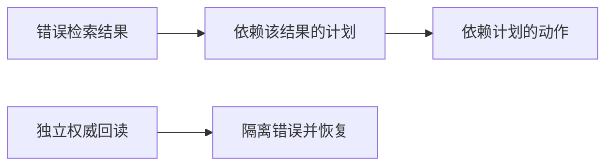

# 第 12 章：异常处理和恢复

> 来源：<https://adp.xindoo.xyz/chapters/>  
> 整理语言：中文  
> 整理更新：2026-10-02；含原理、教学例子与自检。示例不是生产部署验收。

## 本章定位

识别执行失败、工具错误与环境异常，并通过重试、回退、替代方案等方式恢复。

## 先分清失败类型

临时网络错误可有限重试；参数错误应修参数；鉴权失败应处理身份/权限；业务拒绝需解释原因；状态未知的写操作要先查询执行结果。把所有错误都重试，会造成重复写入、限流加剧和成本浪费。

重试应有限次数、指数退避和抖动，并遵守服务返回的等待信息。长任务保存检查点与任务 ID；事件处理记录去重键，避免相同通知重复触发副作用。

## 具体例子：创建记录后超时

客户端发送“创建条目”，服务器已创建，但响应丢失。此时再次发送相同创建请求可能得到两条记录。可先使用同一个幂等键查状态或重试，由服务保证重复键只产生一个结果；如果服务不支持，就按唯一业务标识回读，无法确认时报告状态未知。

故障切换也要保留模型/模板差异：备用模型能连通，不代表工具调用语义完全相同。恢复后重跑关键校验，而不是直接宣称原任务成功。

## 自检与核对

**问题**：HTTP 超时说明服务器一定没执行吗？

**核对**：不说明。它只说明客户端未及时取得结果。读请求通常可重试，写请求必须结合幂等性和状态核对来恢复。

## 来自《深入理解 AI Agent》的增量吸收

- 异常恢复应覆盖模型调用、工具调用、文件修改、外部服务和长任务执行，而不是只捕获程序异常。
- Coding Agent 的恢复思路包括验证修改结果、重试、重新定位、替代工具/模型以及供应商故障切换。
- 异步 Agent 还需要处理事件重复、超时、乱序、状态丢失和中断恢复。
- 失败轨迹应进入评估与回归集，避免同类故障反复出现。

完整来源：[第 5 章 Coding Agent](../05-来源保全/深入理解%20AI%20Agent/source/book/chapter5.md) · [第 6 章 交互](../05-来源保全/深入理解%20AI%20Agent/source/book/chapter6.md) · [第 7 章 Agent 的评估](../05-来源保全/深入理解%20AI%20Agent/source/book/chapter7.md)

## 用目标、轨迹与真实效果诊断失败

2026-10-09 吸收固定来源 Phase14 第 26 课。程序没抛异常只说明运行路径没有触发相应异常；一个合法 JSON 仍可能选错对象、违反范围、引用错误证据或谎报完成。先记录用户目标、允许对象与动作、预定后置条件，再记录模型提议、工具调用/参数、状态回读和终态。观察到的迹象、已验证的失败与根因假设应分开写。

源教学归纳的五类是幻觉动作、范围漂移、错误级联、上下文丢失与工具误用，源码还另加“成功幻觉”。这些是排查入口，允许一条轨迹有多个标签，并非所有失败的穷尽集合。例如版本错配也会造成失败，即使不在这五标签中。不要把重叠标签计数相加当成 100% 覆盖率。

| 排查入口 | 可观察证据 | 易混淆的良性情况与验证方法 |
| --- | --- | --- |
| 幻觉动作 | 调用不存在或在此 runtime 不可用的工具；声称执行但没有调用/回执 | 固定 `KNOWN_TOOLS` 不等当前授权目录，先核注册版本与可用能力 |
| 范围漂移 | 实际对象/动作不在已授权任务内 | “do not write”含 write 不能当写授权；中文、隐含可逆实施与具体对象须结合任务合同 |
| 错误级联 | 错误值经依赖边进入其他决策、调用或系统 | 错误之后正常重试/独立查询不一定受影响；看数据与控制依赖 |
| 上下文丢失 | 明确约束、先前确认或状态在后续选择中未被保留 | 关键词检测只能报告迹象，不能证明模型内部“忘记”；恢复压缩后的关键约束与状态版本 |
| 工具误用 | 参数类型/语义、额外参数、目标权限或调用时机不合合同 | schema 合法不代表业务正确，核对象 ACL、语义、前置条件与副作用 |
| 成功幻觉 | 宣称完成，但承诺的后置条件未满足或没有足够证据 | 只读任务可无状态变化；幂等设置已满足目标也可成功，不强制 `changed=True` |

源 detector 是粗签名：`do not` 后取第一个词再查参数，会把 “do not modify src” 提成 modify，而真实写参数只有 src 时漏检；空的 “do not” 会索引异常。参数 key 子集检查漏类型/额外字段/授权；某 error 后任意两次 call 的规则把正常恢复误判级联。维护时给每项增加相似良性负例和边界输入，测漏报/误报；不把 Counter 分布称为真实 trace 聚类。

## MAST：14 个模式的具体含义

这里依据 [MAST v3 Appendix A](https://arxiv.org/html/2503.13657v3#A1) 的定义作简洁中文概括，例子为自写假业务场景。v1 使用 MASFT 名称，v3 使用 MAST；类别为系统设计 5 项、Agent 间失配 6 项、任务验证 3 项，共 14 项。第三类只有 3 项，“每类至少 4 项”的原教学目标应纠正。

| 类别与编号 | 核心含义 | 便于核对的假例子 |
| --- | --- | --- |
| 系统设计 1.1 | 未遵守任务约束/要求 | 只允许汇总公开资料，却加入私人附件内容 |
| 系统设计 1.2 | 未遵守角色职责/边界 | 审查者本应只给意见，却直接覆盖作者文件 |
| 系统设计 1.3 | 无必要重复已经完成的步骤 | 已有有效回执，仍反复创建同一条目 |
| 系统设计 1.4 | 丢失会话历史或回到较早状态 | 最新确认排除 A，恢复后仍按旧候选含 A 执行 |
| 系统设计 1.5 | 未识别应终止条件 | 全部目标通过验收后继续工具循环直到预算耗尽 |
| Agent 间失配 2.1 | 无必要重启对话 | 子任务尚未结束，协调者丢弃已有上下文重新问同一任务 |
| Agent 间失配 2.2 | 信息不清/不全时未澄清便行动 | 缺少应修改的版本却直接改猜测版本 |
| Agent 间失配 2.3 | 偏离原目标 | 任务是修一个 bug，协作逐步转为无关全站重构 |
| Agent 间失配 2.4 | 有重要信息却未传给需要方 | 查询者已知数据过期，却未通知依赖其结论的汇总者 |
| Agent 间失配 2.5 | 未适当考虑其他 Agent 输入 | 审查者给了可复现反例，作者仍按未被反驳的原结论继续 |
| Agent 间失配 2.6 | 所述推理/计划与实际动作不一致 | 说明只会读取，实际发出写请求 |
| 任务验证 3.1 | 目标未满足就过早终止 | 把提交成功当作全部异步任务完成 |
| 任务验证 3.2 | 没验证或验证不完整 | 只检查生成文件存在，未检查内容与链接 |
| 任务验证 3.3 | 验证/交叉核对方式错误 | 用模型自己编造的参考答案核模型输出 |

相同症状可能有不同来源：目标漂移可能是角色约束弱，也可能是消息丢失、压缩损失、模型理解错误。分类不是自动根因裁决。原论文 §4 讨论系统结构与协调/验证的可改进空间，同时承认基础模型能力局限会造成失败；不能教成“所有失败纯设计问题，升级基础模型毫无作用”。标注一致性如 Cohen's κ 反映特定样本与协议下的标注一致，不证明分类涵盖所有失败或推断具有因果效力。

[Agent 幻觉综述 v2 §III-A](https://arxiv.org/html/2509.18970v2) 中 instruction/context 两点是意图理解局限的表现：未适当理解/遵从指令，以及前文上下文的忘记/误用。综述还讨论感知、推理与动作方面，不能把这两点写成全部 Agent 幻觉分类，也不能把 system 与 user 指令层级混成同一种授权。

## 级联半径需要因果图

令有向无环图中的边 $u\to v$ 表示步骤 $v$ 使用步骤 $u$ 的输出或依赖其控制决定。可达后继集合给出**潜在影响范围**；真正影响还需确认错误数据是否被采纳、是否被纠正，以及最后效果。可报告受影响步骤/对象/系统数、持续时间、额外成本与不可逆损失，不能只取时间上晚于错误的行数。



### CPU 实验：潜在级联与后置条件

完整标准库程序用内存 DAG 模拟错误步骤、两个依赖后继和独立恢复。`descendants` 给潜在影响集，`consumed_bad` 是本 fixture 已观察到使用错误输入的步骤；两者分开。图按拓扑顺序构造，拒绝未知/前向依赖，从而不把循环图当 DAG。三个状态例核只读成功、幂等成功和谎报写成功。

```python
from dataclasses import dataclass

@dataclass(frozen=True)
class Step:
    name: str
    parents: tuple[str, ...]
    consumed_bad: bool = False

steps = [Step('bad_retrieve', ()), Step('plan', ('bad_retrieve',), True),
         Step('act', ('plan',), True), Step('authority_read', ()),
         Step('recover', ('authority_read',))]

def build_graph(items):
    graph = {}
    for step in items:
        if step.name in graph or any(parent not in graph for parent in step.parents):
            raise ValueError('重复、未知或非拓扑顺序依赖')
        graph[step.name] = set()
        for parent in step.parents:
            graph[parent].add(step.name)
    return graph

def descendants(graph, start):
    if start not in graph:
        raise ValueError('未知根步骤')
    seen, todo = set(), list(graph[start])
    while todo:
        item = todo.pop()
        if item not in seen:
            seen.add(item)
            todo.extend(graph[item])
    return seen

graph = build_graph(steps)
potential = descendants(graph, 'bad_retrieve')
confirmed = {s.name for s in steps if s.name in potential and s.consumed_bad}
assert potential == confirmed == {'plan', 'act'}
assert 'recover' not in potential  # 晚到的恢复不是错误数据的后继
try:
    build_graph([Step('a', ('b',)), Step('b', ('a',))])
except ValueError:
    pass
else:
    raise AssertionError('循环不能伪装成 DAG')

cases = [('readonly', {'value': 7}, {'value': 7}, {'value': 7}),
         ('idempotent', {'flag': True}, {'flag': True}, {'flag': True}),
         ('false_success', {'flag': False}, {'flag': False}, {'flag': True})]
verdict = {}
for name, before, observed, required in cases:
    changed = before != observed
    verified = observed == required
    verdict[name] = (changed, verified)
assert verdict == {'readonly': (False, True), 'idempotent': (False, True),
                   'false_success': (False, False)}
print('potential', sorted(potential), 'confirmed', sorted(confirmed), 'radius', len(confirmed))
print('changed_and_postcondition', verdict)
```

2026-10-09 从最终正文提取运行；它验证 fixture 中的依赖遍历与明确后置条件，未执行真实工具、未发现真实因果关系，也没有观测外部服务。生产系统需记录 input lineage、任务/调用 ID、版本与回执；状态未知不能当成功。幂等与回读证据接[案例方法论](../../LLM%20工程实践/10-案例方法论.md)，重试与持久状态接[MCP 通信与状态工程](../06-专题扩展/06-MCP通信与状态工程.md)。

源静态 `failure-modes.svg` 可用于区分排查入口；动态图 `failure-cascade` 四节点按预设时间变色和闪电传播，没有依赖数据、实际 detector 或严重度计算，不能证明每个后续步骤都受影响。真正的检测应在关键权限/状态/事实边界配置相应判据，不要求所有推理 token 都运行昂贵 judge。

## 第 26 课练习：参考判据

1. **增加“成功但状态未变”检测。** 原源码已有 detector，本题应改进它。用只读成功、幂等已满足、未达目标却说完成三组反例，核预定后置条件与独立 receipt，不单靠 `state_changed`。
2. **标注 100 条真实轨迹，哪类主导？** 本批未采真实轨迹。实践时匿名化并分层抽样，保标签定义版本、重叠标签、分母、严重度与修复成本。高频不等高损失，采样产品不能外推整个行业。
3. **实现级联半径。** 构造依赖 DAG，报告潜在后继与已确认影响，独立恢复作为负例；必要时报告跨系统对象、时长与费用。时间顺序不能替因果证据。
4. **从 14 模式选三种写 detector。** 在固定 v3 定义下挑业务相关模式，给可观察判据、正常负例和人工复核；规则/模型 judge 各自校准，不声称三种规则自动覆盖全 14 类。
5. **CI 中至少 5% 被标记就失败。** 5% 是练习策略，先决定严重失败是否一例即阻断、分母是轨迹还是调用、未知如何处理。固定同版本回归/留出 gold，测误报及不确定性，再实际部署 gate；本批未部署 CI。

## 第 26 课自检：七题与答案

1. **MAST 的核心论点可否说成基础模型扩展不能解决任何失败？** 不可。系统设计、协调与验证是重要改进方向，模型能力也会影响失败；二者互补。
2. **embedding 版本错配属于源五标签吗？** 不是该五标签的直接项目，但可造成真实失败。标签表的范围不能排除现实风险。
3. **怎样确认级联错误？** 核错误沿数据/控制依赖被后续步骤采纳并产生后果；发生在 error 之后还不足以成立。
4. **指令与上下文两表现是全部幻觉吗？** 不是，它们属于该综述意图理解部分；还要看感知、推理与动作。
5. **什么是成功幻觉？** 未满足承诺目标却宣称成功，或缺证据却断言完成；“未改变状态”本身不是充分条件。
6. **为什么只监控 crash 不够？** 格式合法与进程存活仍可业务失败，要核目标、内容、权限和效果；本源合成样本不能证明“多数”失败比例。
7. **每一步都必须同一种 classifier 吗？** 不必。关键边界采用参数/权限校验、可信证据和状态回读；按风险选择 gate 并记录失败，任何单一 gate 都不保证完全安全。

来源：`rohitg00/ai-engineering-from-scratch` 固定 `3be078b37ffd8f0c04953c0678e48f5c6d0c7775`，`phases/14-agent-engineering/26-failure-modes-agentic`。本批课内全读与图示静态阅读有独立准备证据；一手核验仅包括 MAST v3 §4 与 Appendix A、上述综述 §III-A 相关定义，不称整论文已读。原源码/SDK/模型、100 条真实 trace、真实告警与 CI 未运行。
